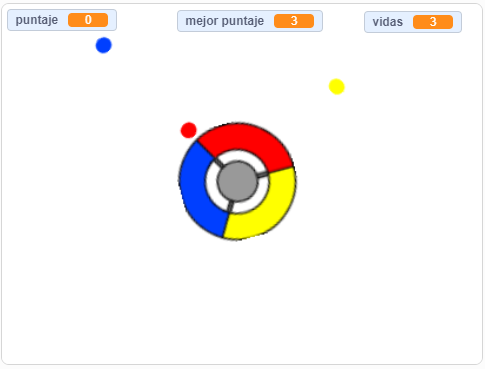

## ¿Qué sigue?

¡Prueba el proyecto [Atrapa los puntos](https://projects.raspberrypi.org/es-LA/projects/catch-the-dots?utm_source=pathway&utm_medium=whatnext&utm_campaign=projects) para crear un juego de velocidad de reacción! En ese proyecto, aprenderás a hacer clones de objeto y a usar variables para incrementar la velocidad del juego gradualmente.

--- no-print ---

Usa las teclas de dirección de tu teclado para girar el controlador y atrapar los puntos voladores a medida que llegan al centro. Si no logras alcanzar tres puntos, el juego termina.

  <iframe allowtransparency="true" width="485" height="402" src="https://scratch.mit.edu/projects/embed/414804789/?autostart=false" frameborder="0" scrolling="no"></iframe>
  

--- /no-print ---

--- print-only ---

--- /print-only ---

***
Este proyecto fue traducido por voluntarios:

Milagros del Pilar Rios Ribeiro

Melanie Danna Vargas Casanova

Verónica Valencia Límaco

Gracias a los voluntarios, podemos dar a las personas de todo el mundo la oportunidad de aprender en su propio idioma. Puedes ayudarnos a llegar a más personas ofreciéndote como voluntario para traducir. Más información en [rpf.io/translate](https://rpf.io/translate).
