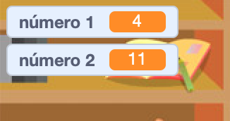

## Crear preguntas

Vas a empezar por crear preguntas aleatorias que el jugador tiene que responder.

--- task ---

Abre un nuevo proyecto de Scratch.

**Online:** Abre un nuevo proyecto Scratch en línea en [rpf.io/scratch-new](http://rpf.io/scratch-new){:target="_blank"}.

**Offline:** Abre un nuevo proyecto en el editor offline.

Si necesitas descargar e instalar el editor offline de Scratch, puedes encontrarlo en [rpf.io/scratchoff](http://rpf.io/scratchoff){:target="_blank"}.

--- /task ---

--- task ---

Agrega un personaje y un fondo para tu juego. ¡Puedes elegir el que gustes! Aquí tienes un ejemplo:


--- /task ---

--- task ---

Asegúrate que tienes tu personaje seleccionado. Crea dos nuevas variables, llamadas `número 1`{:class="block3variables"} y `número 2`{:class="block3variables"}, para almacenar los números de las preguntas de la prueba.




[[[generic-scratch3-add-variable]]]

--- /task ---

--- task ---

Agrega código a tu personaje para dar a ambas `variables`{:class="block3variables"} un número `aleatorio`{:class="block3operators"} entre 2 y 12.


```blocks3
when flag clicked
set [número 1 v] to (pick random (2) to (12))
set [número 2 v] to (pick random (2) to (12))
```

--- /task ---

--- task ---

Agrega código para `preguntar`{:class="block3sensing"} al jugador por la respuesta, y luego `decir por dos segundos`{:class="block3looks"} si la respuesta fue correcta o incorrecta:


```blocks3
when flag clicked
set [número 1 v] to (pick random (2) to (12))
set [número 2 v] to (pick random (2) to (12))
+ ask (join (número 1)(join [ x ] (número 2))) and wait
+ if <(answer) = ((número 1)*(número 2))> then
+ say [¡sí! :)] for (2) seconds
+ else
+ say [no :(] for (2) seconds
+ end
```

--- /task ---

--- task ---

Prueba tu proyecto dos veces: responde una respuesta correctamente, y otra incorrectamente.

--- /task ---

--- task ---

Agrega un bucle `infinito`{:class="block3control"} que englobe este código, para que el juego haga muchas preguntas seguidas al jugador.

--- hints ---


--- hint ---

Necesitas agregar un bloque `infinito`{:class="block3control"}, y poner todo el código excepto el bloque `al hacer click en la bandera`{:class="block3control"}.

--- /hint ---

--- hint ---

Aquí está el bloque que necesitas:

```blocks3
forever
end
```

--- /hint ---

--- hint ---

Tu código debería lucir así:

```blocks3
when flag clicked
+ forever
    set [número 1 v] to (pick random (2) to (12))
    set [número 2 v] to (pick random (2) to (12))
    ask (join (número 1)(join [ x ] (número 2))) and wait
    if <(answer) = ((número 1)*(número 2))> then
        say [¡sí! :)] for (2) seconds
    else
        say [no :(] for (2) seconds
    end
end
```

--- /hint ---

--- /hints ---

--- /task ---
