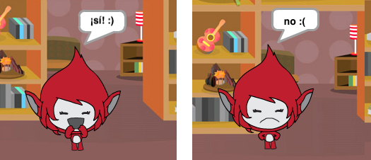

## Desafío: agrega una puntuación y reacciones

¿Puedes agregar una puntuación al juego?

Puedes agregar código para que el jugador gane un punto por cada respuesta correcta. Si quieres ser malvado, puedes agregar código para regresar la puntuación a 0 si el jugador da una respuesta incorrecta!

[[[generic-scratch3-high-score]]]

¿Puedes hacer que tu personaje reaccione a la respuesta del jugador cambiando a un disfraz diferente si la respuesta es correcta o incorrecta?

