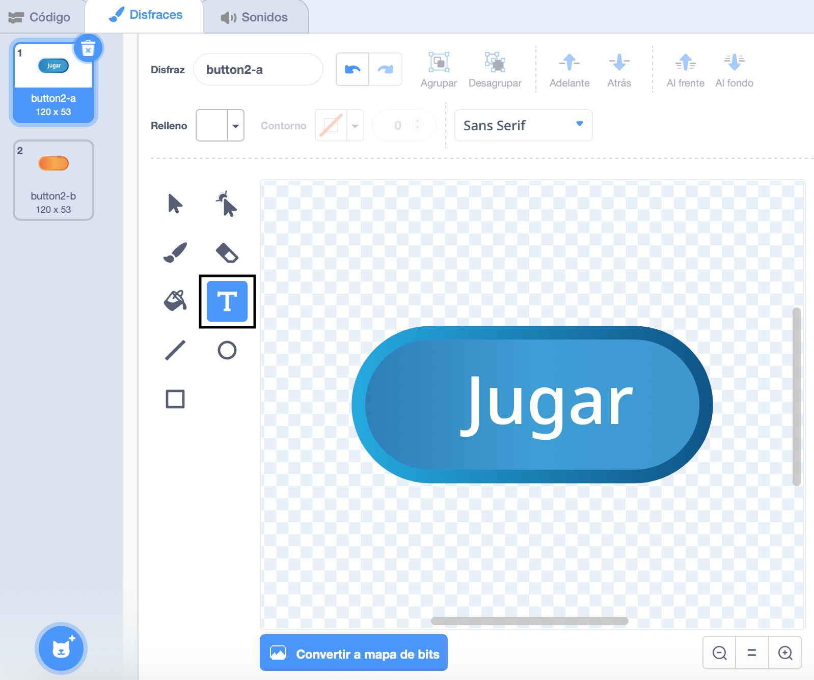
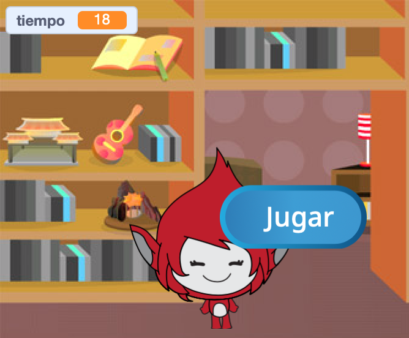
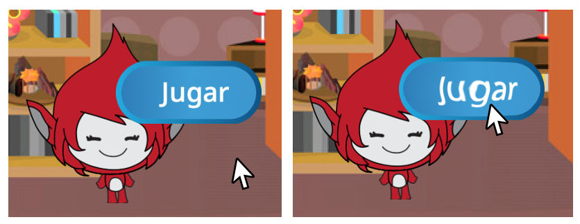

## Varias partidas

Ahora vas a agregar un botón "Jugar", para que el jugador pueda jugar el juego muchas veces.

\--- task \---

Crea un nuevo botón objeto "Jugar" para que el jugador haga clic y empiece un nuevo juego.

Puedes dibujar el objeto tú mismo, o editar un objeto de la librería.



\--- /task \---

\--- task \---

Agrega este código al botón objeto:


```blocks3
    when flag clicked
    show

    when this sprite clicked
    hide
    broadcast (start v)
```

\--- /task \---

El nuevo código incluye otro bloque de `transmisión`{:class="block3events"}, el cual envía el mensaje "inicio".

The new code makes the 'Play' button sprite show when player clicks on the flag. Cuando el jugador hace clic en el botón objeto, el objeto se oculta y luego transmite un mensaje a la que otros objetos pueden reaccionar.

Por el momento, el objeto empieza a hacer preguntas cuando el jugador hace clic en la bandera. Cambia el código de tu juego para que el objeto empiece a hacer preguntas cuando reciba la `transmisión`{:class="block3events"} "inicio".

\--- task \---

Selecciona el objeto y, en la sección del código, reemplazar el bloque de `al hacer clic en la bandera`{:class="block3events"} con un bloque `al recibir inicio`{:class="block3events"}.


```blocks3
<br />- when flag clicked
+ when I receive [start v]
set [number 1 v] to (pick random (2) to (12))
set [number 2 v] to (pick random (2) to (12))
ask (join (number 1)(join [ x ] (number 2))) and wait
if <(answer) = ((number 1)*(number 2))> then
    say [yes! :)] for (2) seconds
else
    say [nope :(] for (2) seconds
end
```

\--- /task \---

\--- task \---

Haz clic en la bandera verde, y después en el nuevo botón "Jugar" para ver si funciona. Deberías notar que el juego no empieza antes de que hagas clic en el botón.

\--- /task \---

¿Puedes ver que el temporizador empieza al hacer clic en la bandera verde, y no cuando el juego empieza?



\--- task \---

¿Puedes cambiar el código del temporizador para que este empiece cuando el jugador haga clic en el botón?

\--- / task \---

\--- task \---

Agrega un código al botón objeto para que este se muestre de nuevo al final de cada partida.


```blocks3
    when I receive [end v]
    show
```

\--- /task \---

\--- task \---

Prueba el botón "Jugar" jugando un par de partidas. El botón debería aparecer al final de cada partida.

Para probar el juego más rápido, puedes cambiar el valor de `tiempo`{:class="block3variables"} para que cada partida dure solo pocos segundos.


```blocks3
    set [time v] to [10]
```

\--- /task \---

\--- task \---

Puedes cambiar el aspecto del botón cuando el puntero del mouse pase por encima.


```blocks3
    when flag clicked
    show
    forever
    if <touching (mouse-pointer v)?> then
        set [fisheye v] effect to (30)
    else
        set [fisheye v] effect to (0)
    end
    end
```



\--- /task \---