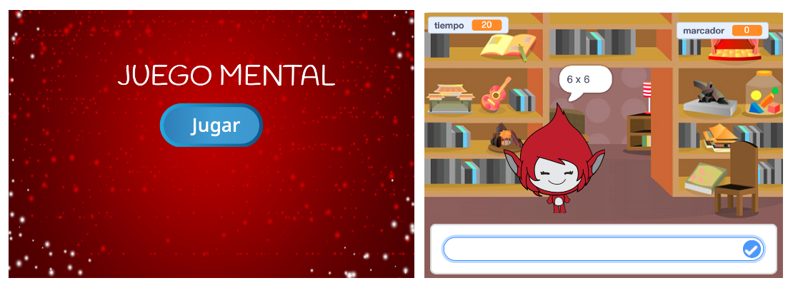

## Desafío: crear una pantalla de inicio

¿Puedes agregar otro fondo para que sea la pantalla de inicio del juego?

Puedes usar los bloques `al recibir inicio`{:class="block3events"} y `al recibir fin`{:class="block3events"} para cambiar entre los fondos.

Para mostrar u ocultar el personaje cuando el juego cambia entre fondos, puedes usar los bloques `mostrar`{:class="block3looks"} y `ocultar`{:class="block3looks"}.

Para mostrar u ocultar el temporizador y la puntuación cuando al juego cambia entre fondos, puedes usar los bloques `mostrar variable`{:class="block3variables"} y `ocultar variable`{:class="block3variables"}.

