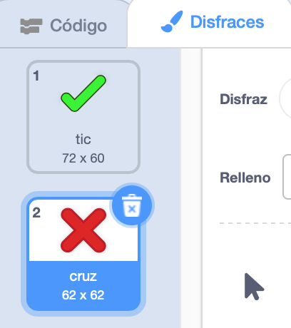
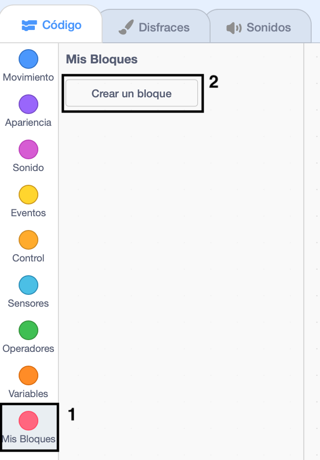
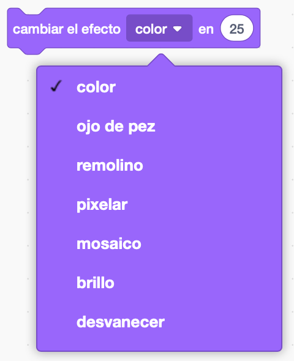

## Agregar gráficos

Por el momento, el personaje objeto o solo dice ` ¡sí! :) ` o ` no :( ` a las respuestas del jugador. Agrega algunos gráficos para que el jugador sepa si su respuesta es correcta o incorrecta.

\--- task \---

Crea un nuevo objeto llamado "Resultado", y dale dos veces "tic" y una "cruz".



\--- / task \---

\--- task \---

Cambia el código de tu personaje objeto para que, en vez de decirle algo al jugador, `transmita`{:class="block3events"} los mensajes "correcto" o "incorrecto'.


```blocks3
if <(answer) = ((number 1)*(number 2))> then

- say [yes! :)] for (2) seconds
+ broadcast (correct v)
else
- say [nope :(] for (2) seconds
+ broadcast (wrong v)
end
```

\--- / task \---

\--- task\---

Ahora puedes usar estos mensajes para `mostrar`{:class="block3looks"} el disfraz de 'tic' o 'cruz'. Agrega el siguiente código al objeto "Resultado":


```blocks3
    when I receive [correct v]
    switch costume to (tick v)
    show
    wait (1) seconds
    hide

    when I receive [wrong v]
    switch costume to (cross v)
    show
    wait (1) seconds
    hide

    when flag clicked
    hide
```

\--- / task \---

\--- task \---

Prueba el juego de nuevo. ¡Deberías ver el tic cada vez que respondas correctamente, y la “cruz” cada vez que respondas incorrectamente!


\--- /task \---

¿Te has dado cuenta de que el código de `al recibir correcto`{:class="block3events"} y de `al recibir incorrecto`{:class="block3events"} es casi idéntico?

Para poder cambiar el código fácilmente, vas a crear un bloque personalizado.

\--- task \---

Selecciona el objeto "Resultado". Después haz clic en `Mis bloques`{:class="block3myblocks"} y luego en **Crear un bloque**. Crea un nuevo bloque y llámalo `animar`{:class="block3myblocks"}.




\--- /task \---

\--- task \---

Mueve el código para `mostrar`{:class="block3looks"} y `ocultar`{:class="block3looks"} el objeto "Resultado" al bloque `animar`{:class="block3myblocks"}:


```blocks3
define animate
show
wait (1) seconds
hide
```

\--- /task \---

\--- task \---

Asegúrate de haber eliminado los bloques `mostrar`{:class="block3looks"} y `ocultar`{:class="block3looks"} debajo de **ambos** bloques `cambiar disfraz`{:class="block3looks"}.

Después añade el bloque `animar`{:class="block3myblocks"} debajo de ambos bloques `cambiar disfraz`{:class="block3looks"}. Tu código ahora debería verse así:


```blocks3
    when I receive [correct v]
    switch costume to (tick v)
    animate:: custom

    when I receive [wrong v]
    switch costume to (cross v)
    animate:: custom
```

\--- /task \---

Gracias al bloque personalizado `animar`{:class="block3myblocks"}, ahora solo necesitas hacer un cambio al código si quieres mostrar los disfraces del objeto "Resultado" durante más o menos tiempo.

\--- task \---

Cambia el código para que se muestren los disfraces de "tic" o "cruz" durante 2 segundos.

\--- / task \---

\--- task \---

En vez de `mostrar`{:class="block3looks"} y `ocultar`{:class="block3looks"} los disfraces de "tic" o "cruz", puedes cambiar el bloque `animar`{:class="block3myblocks"} para que los disfraces desaparezcan gradualmente.


```blocks3
    define animate
    set [ghost v] effect to (100)
    show
    repeat (25)
        change [ghost v] effect by (-4)
    end
    hide
```

\--- /task \---

¿Puedes mejorar la animación de los gráficos "tic" o "cruz"? Puedes añadir código para hacer que los disfraces también desaparezcan gradualmente o puedes usar estos otros efectos geniales:

