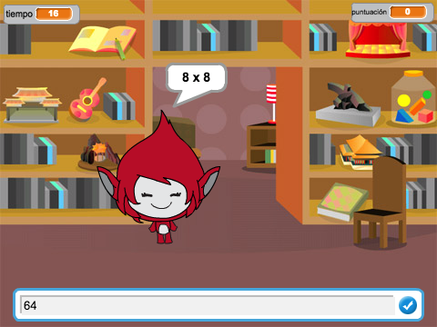

## Introducción

En este proyecto aprenderá cómo crear un juego de tablas de multiplicar, en el que debe responder a tantas preguntas en forma correcta como pueda en 30 segundos.

  <iframe allowtransparency="true" width="485" height="402" src="https://scratch.mit.edu/projects/embed/42225768/?autostart=false" frameborder="0"></iframe>
  

### Información adicional para los líderes del club

Si necesitas imprimir este proyecto, use la [versión para imprimir](https://projects.raspberrypi.org/en/projects/brain-game/print).

## \--- collapse \---

## título: Notas del líder del club

## Introducción:

En este proyecto, los niños aprenderán cómo hacer un juego de tablas de multiplicar, en el que el jugador debe responder a tantas preguntas en forma correcta como sea posible en 30 segundos.

## Rescursos

Para este proyecto, se debe usar Scratch 2. Scratch 2 puede ser usado en línea en [jumpto.cc/scratch-on](http://jumpto.cc/scratch-on) o puede ser descargado desde [jumpto.cc/scratch-off](http://jumpto.cc/scratch-off) y se usa sin conexión.

Puede encontrar una versión completa de este proyecto [en línea](http://scratch.mit.edu/projects/42225768/#editor) o puede descargarlo haciendo clic en el enlace 'Materiales del proyecto', que contiene:

* Juego_Cerebral_ES.sb2

## Objetivos del Aprendizaje

* El proyecto refuerza el aprendizaje de habilidades de programación aprendidas previas, y muestra cómo las transmisiones se pueden utilizar para crear un sistema de menú de juego simple.

Este proyecto incluye elementos desde los siguientes aspectos del [curriculó de digitalización de Raspberry Pi](http://rpf.io/curriculum):

* [Combina construcciones de programación para resolver un problema.](https://www.raspberrypi.org/curriculum/programming/builder)

## Desafíos

* "Cambiar disfraces" - cambiar la apariencia del personaje en respuesta a respuestas correctas e incorrectas;
* "Añadir una puntuación" - añadir un punto por cada pregunta contestado correctamente;
* "Pantalla de inicio" - cambiar el fondo en respuesta al `inicio`{:class="eventosdebloques"} y `fin`{:class="eventosdebloques"} transmitir mensajes, creando 2 'pantallas' del juego;
* "Animación mejorada" - el uso de bucles y efectos para mejorar la animación gráfica correcta / incorrecta;
* "Sonido y música" - consolidación del aprendizaje de bucles de música y efectos de sonido;
* "Carrera hasta 10 puntos" - cambiar la lógica del juego para crear un nuevo objetivo del juego;
* "Pantalla de instrucciones": consolidación del uso de transmisiones para crear un menú del juego, al añadir un nuevo botón y pantalla de "instrucciones".

\--- /collapse \---

## \--- collapse \---

## título: materiales del proyecto

## Recursos del líder del club

* [Proyecto Scratch 2 completado descargable](resources/BrainGame.sb2)
* [Proyecto Scratch 2 completado en línea](http://scratch.mit.edu/projects/42225768/#editor)

\--- /collapse \---