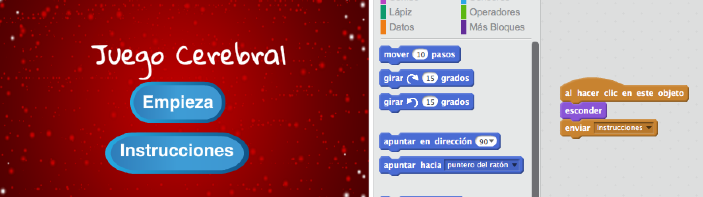

\--- challenge \---

## Desafío: Pantalla de instrucciones

¿Puedes añadir una pantalla de instrucciones a tu juego, en la que expliques al jugador cómo se juega? Necesitarás un botón de ‘Instrucciones’, y otro fondo de escenario.



Puede que también necesites un botón de ‘Volver’ que te devuelva al menú principal.

```blocks
    enviar [menú principal]
```

\--- /challenge \---