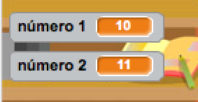

## Creando preguntas

Let's start by creating random questions for the player to answer.

+ Empieza un nuevo proyecto de Scratch y borra el objeto gato para que el proyecto esté vacío. Puedes encontrar el editor en línea de Scratch en <a href="http://jumpto.cc/scratch-new" target="_blank">jumpto.cc/scratch-new </a>.

+ Escoge un personaje y un fondo para tu juego. ¡Puedes escoger el que más te guste! Aquí tienes un ejemplo:
    
    

+ Crea 2 nuevas variables llamadas `número 1`{:class="blockdata"} y `número 2`{:class="blockdata"}. Estas variables almacenarán los 2 números que se van a multiplicar.
    
    

+ Añade código a tu personaje, para fijar estas dos variables a un número `aleatorio`{:class="blockoperators"} entre 2 y 12.
    
    ```blocks
    al presionar bandera verde
    fijar [número 1 v] a (número al azar entre (2) y (12))
    fijar [número 2 v] a (número al azar entre (2) y (12))
```

+ A continuación puedes pedir al jugador que dé una respuesta, y decirle si es correcta o incorrecta.
    
    ```blocks
    when flag clicked
    set [number 1 v] to (pick random (2) to (12))
    set [number 2 v] to (pick random (2) to (12))
    ask (join (number 1)(join [ x ] (number 2))) and wait
    if <(answer) = ((number 1)*(number 2))> then
        say [yes! :)] for (2) secs
    else
        say [nope :(] for (2) secs
    end
```

+ Prueba tu proyecto del todo, dando una respuesta correcta y una incorrecta.

+ Add a `forever`{:class="blockcontrol"} loop around this code, so that the player is asked lots of questions.

+ Create a countdown timer on the stage, using a variable called `time`{:class="blockdata"}. The 'Ghostbusters' project has instructions for making a timer (in step 5) if you need help!

+ Test your project again - you should be able to continue asking questions until the time runs out.