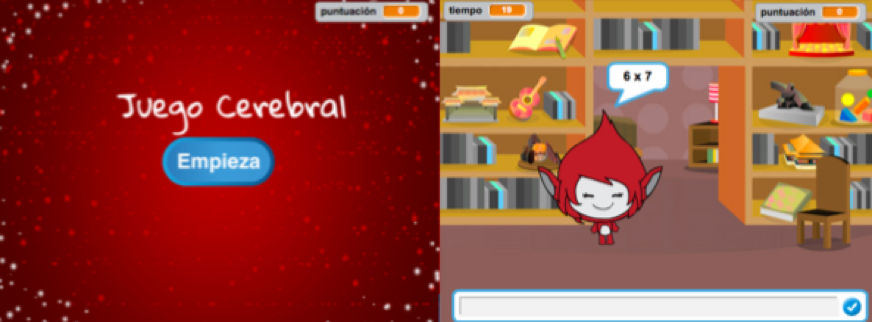

\--- challenge \---

## Challenge: Start screen

Can you add another backdrop to your stage, which will become your game's start screen? You can use the `when I receive start`{:class="blockevents"} and `when I receive end`{:class="blockevents"} blocks to switch between backdrops.

You can also show and hide your character, and even show and hide your timer by using these blocks:

```blocks
show variable [time v]
```

```blocks
hide variable [time v]
```



\--- /challenge \---