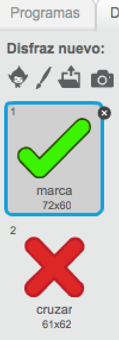
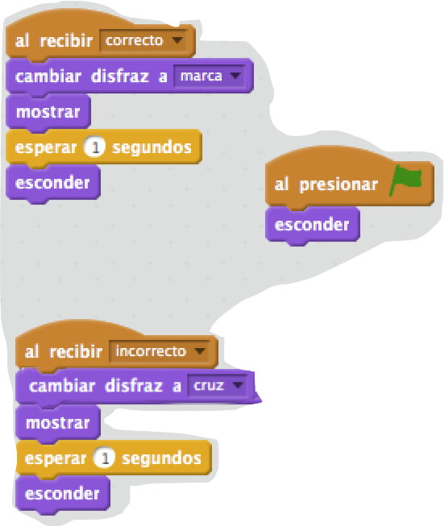
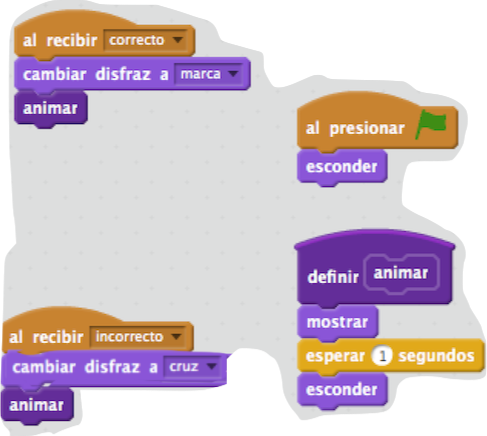

## Añadir gráficos

En lugar de que tu personaje sólo diga `¡Sí! :)` o `No :(` al jugador, vamos a añadir algunos gráficos que ayuden al jugador a saber cómo lo está haciendo.

+ Crea un nuevo objeto con el nombre ‘Resultado’, que contenga un disfraz de ‘visto bueno’ y uno de ‘cruz’.
    
    

+ Cambia el código de tu personaje para que, en lugar de decir al jugador cómo lo está haciendo, envíe mensajes de `correcto`{:class="blockevents"} y `error`{:class="blockevents"}.
    
    

+ Ahora ya puedes usar estos mensajes para que aparezcan los disfraces de ‘visto bueno’ o ‘cruz’. Añade este código a tu nuevo objeto ‘Resultado’:
    
    

+ Prueba de nuevo tu juego. ¡Deberías de ver un visto bueno siempre que des una respuesta correcta, y una cruz cuando te equivoques!
    
    

+ ¿Te has dado cuenta de que el código para `al recibir correcto`{:class="blockevents"} y `al recibir error`{:class="blockevents"} es casi idéntico? Vamos a crear una función que te ayudará a hacer cambios en tu código más fácilmente.
    
    En el objeto ‘Resultado’, haz clic en `Más Bloques`{:class="blockmoreblocks"}, y a continuación ‘Crear un bloque’. Crea una nueva función llamada `animar`{:class="blockmoreblocks"}.
    
    

+ Entonces podrás añadir el código de la animación a tu nueva función de animación, y usar la función dos veces:
    
    

+ Entonces, si quieres que el visto bueno y la cruz aparezcan durante más o menos tiempo, sólo necesitas hacer un cambio en tu código. ¡Pruébalo!

+ En lugar de simplemente mostrar y esconder el visto bueno y la cruz, podrías cambiar tu función de animación para que los gráficos se desvanezcan.
    
    ```blocks
    definir [animate]
establecer efecto [desvanecer v] a (100)
mostrar
repetir (25)
   cambiar efecto [desvanecer v] por (-4)
fin
esconder
```