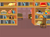

## بازی های چندگانه

حالا شما قصد دارید یک دکمه Play را اضافه کنید تا بازیکن بتواند بازی شما را چند بار بازی کند.

\--- وظیفه \--- یک دکمه ی 'Play' جدید ایجاد کنید که بازیکن باید روی آن کلیک کند تا یک بازی جدید را شروع کند.

شما می توانید خودتان را به رسمیت بگذارید یا ویرایشگر از کتابخانه را ویرایش کنید.


\--- /وظیفه \---

\--- وظیفه \--- این کد را به دکمه ی خود اضافه کنید:


```blocks3
    زمانی که پرچم روی آن کلیک کنید
    نمایش

    زمانی که این صحنه کلیک کرد
    پنهان
    پخش (شروع V)
```

\--- /وظیفه \---

کد جدید شامل یکی دیگر از برنامه پخش ``{: class = "block3events"} است که پیام "شروع" را ارسال می کند.

کد جدید باعث می شود که دکمه Play را نشان دهد زمانی که بازیکن بر روی پرچم کلیک کند. هنگامی که بازیکن روی دکمه راست کلیک می کند، افشای پنهان می کند و سپس پیامی را ارسال می کند که سایر طرفداران می توانند واکنش نشان دهند.

در حال حاضر، فیلد شخصیت شروع به سوال کردن میکند وقتی بازیکن روی پرچم کلیک میکند. کد بازی خود را تغییر دهید به طوری که کاراکتر شخصیت شروع به سوال کردن می کند وقتی که "شروع" `پخش می شود`{: class = "block3events"}.

\--- کار \--- کاراکتر کاراکتر خود را انتخاب کنید و در قسمت کد آن `پرچم`{: class = "block3events"} جایگزین کنید، با `شروع کنید`{: class = "block3events" } مسدود کردن.


```blocks3
<br />- هنگامی که پرچم
+ هنگام دریافت [شروع v]
تنظیم [شماره 1 V] به (انتخاب تصادفی (2) به (12))
مجموعه [شماره 2 V] به (انتخاب تصادفی (2) به (12) )
بپرسید (پیوستن (شماره 1) (پیوستن به [x] (شماره 2))) و صبر کنید
اگر <(پاسخ) = ((شماره 1) * (شماره 2))> سپس
    می گویند [بله! :)) برای (2) ثانیه
دیگر
    می گویند [nope :(] برای (2) ثانیه
پایان
```

\--- /وظیفه \---

\--- وظیفه \---

روی پرچم سبز کلیک کنید و سپس بر روی دکمه Play کلیک کنید تا آزمایش کنید آیا کار می کند. شما باید ببینید که بازی قبل از اینکه بر روی دکمه کلیک شود شروع نمی شود.

\--- /وظیفه \---

آیا می توانید ببینید که تایمر هنگامی شروع می شود که پرچم سبز روی آن کلیک شود، به جای آنکه بازی شروع شود؟


\--- وظیفه \---

آیا می توانید کد برای تایمر را تغییر دهید به طوری که تایمر شروع می شود زمانی که بازیکن بر روی دکمه کلیک کند؟

\--- /وظیفه \---

\--- وظیفه \--- کد را به دایرکتوری دکمه خود اضافه کنید تا دکمه دوباره در انتهای هر بازی نشان داده شود.


```blocks3
    زمانی که من [پایان v]
    نمایش را دریافت می کنم
```

\--- /وظیفه \---

\--- وظیفه \---

دکمه «بازی» را با بازی چند بازی ای آزمایش کنید. این دکمه باید در پایان هر بازی نشان داده شود.

برای آزمایش سریعتر بازی، می توانید مقدار `زمان`{: class = "block3variables"} را تغییر دهید تا هر بازی تنها چند ثانیه طول بکشد.



```blocks3
    تنظیم [زمان V] به [10]
```

\--- /وظیفه \---

\--- وظیفه \--- شما می توانید تغییر دهید که چگونه دکمه به نظر می رسد زمانی که نشانگر ماوس بر روی آن قرار می گیرد.


```blocks3
    زمانی که پرچم روی
    کلیک نمایش داده می شود
    برای همیشه
    اگر <touching (mouse-pointer v)?> سپس
        تنظیم [fisheye v] به (30)
    دیگر
        تنظیم [اثر fisheye v] به (0)
    پایان
    پایان
```

 \--- /وظیفه \---