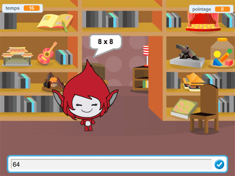

--- no-print ---

Ceci est la version **Scratch 3** du projet. Il y a aussi une version [Scratch 2 du projet](https://projects.raspberrypi.org/fr-FR/projects/brain-game-scratch2).

--- /no-print ---

## Introduction

Dans ce projet, tu vas créer un quiz mathématique dans lequel le joueur dispose de 30 secondes pour donner autant de réponses correctes que possible.

### Ce que tu feras

--- no-print --- Clique sur le bouton pour commencer. Tape la réponse à la question, puis appuie sur la touche <kbd>Entrée</kbd>.

  <iframe allowtransparency="true" width="485" height="402" src="https://scratch.mit.edu/projects/embed/350711225/?autostart=false" frameborder="0" scrolling="no"></iframe>
  

--- /no-print ---

--- print-only ---  --- /print-only ---

--- collapse ---
---
title: Ce que tu vas apprendre
---

+ Comment utiliser les envoyer à tous dans Scratch
+ Comment créer et utiliser un bloc Scratch personnalisé

--- /collapse ---

--- collapse ---
---
title: Ce qu'il faut avoir
---

### Matériel informatique

+ Un ordinateur capable d'exécuter Scratch 3

### Logiciels

+ Scratch 3 ([en ligne](http://rpf.io/scratchon) ou [hors ligne](http://rpf.io/scratchoff)")

Question

--- collapse ---
---
title: Informations supplémentaires pour les éducateurs
---

--- no-print --- Si tu as besoin d'imprimer ce projet, veille à utiliser la [version](https://projects.raspberrypi.org/fr-FR/projects/brain-game/print)imprimable. --- /no-print ---

Tu peux trouver le [projet terminé ici](http://rpf.io/p/fr-FR/brain-game-get){:target="_blank"}.

--- /collapse ---