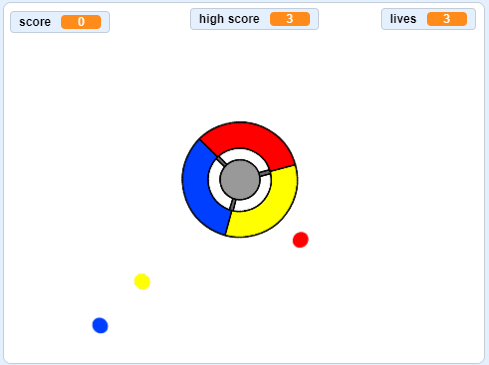

## Que faire ensuite?

Essayez le projet [Catch the dots](https://projects.raspberrypi.org/en/projects/catch-the-dots?utm_source=pathway&utm_medium=whatnext&utm_campaign=projects) pour créer un jeu de réaction! Dans ce projet, vous allez apprendre à créer des clones d’images-objets et à utiliser une variable pour accélérer progressivement le jeu.

\--- no-print \--- Utilisez les touches fléchées de votre clavier pour faire pivoter la molette du contrôleur et capturer les points volants lorsqu'ils atteignent le centre. Si vous manquez trois points, le jeu est terminé.

  <iframe allowtransparency="true" width="485" height="402" src="https://scratch.mit.edu/projects/embed/252923761/?autostart=false" frameborder="0" scrolling="no"></iframe>
  

\--- /no-print \---

\--- impression seule \---  \--- / impression seule \---