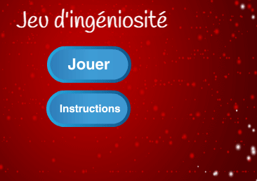

\--- défi \---

## Défi: Écran d'instruction

Pouvez-vous ajouter un écran d'instructions à votre jeu, indiquant à votre joueur comment jouer? Vous aurez besoin d'un bouton 'Instructions' et d'un autre arrière plan.



Vous pouvez également avoir besoin d'un bouton «Retour» pour vous rendre au menu principal.

```blocks
    envoyer a tous [menu principal v]
```

\--- /défi \---