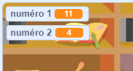

## Création des questions

Commençons par créer des questions aléatoires auxquelles le joueur devra répondre.

+ Démarrez un nouveau projet Scratch et supprimez le lutin de chat afin que votre projet soit vide. You can find the online Scratch editor at <a href="http://jumpto.cc/scratch-new" target="_blank">jumpto.cc/scratch-new</a>.

+ Choose a character and a backdrop for your game. You can choose any you like! Here's an example:
    
    

+ Create 2 new variables called `number 1`{:class="blockdata"} and `number 2`{:class="blockdata"}. These variables will store the 2 numbers that will be multiplied together.
    
    

+ Add code to your character, to set both of these variables to a `random`{:class="blockoperators"} number between 2 and 12.
    
    ```blocks
        when flag clicked
        set [number 1 v] to (pick random (2) to (12))
        set [number 2 v] to (pick random (2) to (12))
    ```

+ You can then ask the player for the answer, and let them know if they were right or wrong.
    
    ```blocks
        when flag clicked
        set [number 1 v] to (pick random (2) to (12))
        set [number 2 v] to (pick random (2) to (12))
        ask (join (number 1)(join [ x ] (number 2))) and wait
        if <(answer) = ((number 1)*(number 2))> then
            say [yes! :)] for (2) secs
        else
            say [nope :(] for (2) secs
        end
    ```

+ Test your project fully, by answering one question correctly and one with the wrong answer.

+ Add a `forever`{:class="blockcontrol"} loop around this code, so that the player is asked lots of questions.

+ Create a countdown timer on the stage, using a variable called `time`{:class="blockdata"}. The 'Ghostbusters' project has instructions for making a timer (in step 5) if you need help!

+ Test your project again - you should be able to continue asking questions until the time runs out.