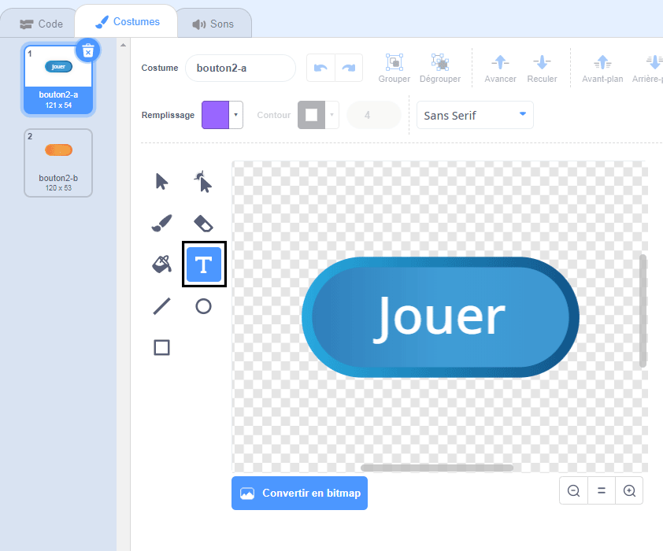
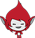
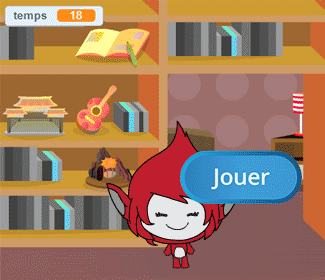
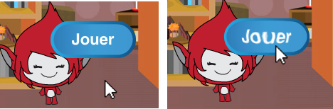

## Jeux multiples

Tu vas maintenant ajouter un bouton "Jouer" pour que le joueur puisse jouer à ton jeu plusieurs fois.

--- task ---

Crée un nouveau sprite de bouton "Jouer" sur lequel le joueur doit cliquer pour commencer une nouvelle partie.

Tu peux dessiner le sprite toi-même ou éditer un sprite à partir de la bibliothèque.



--- /task ---

--- task ---

Ajoute ce code à ton sprite bouton:


```blocks3
	when flag clicked
	show

	when this sprite clicked
	hide
	broadcast (démarrer v)
```

--- /task ---

Le nouveau code comprend un autre bloc `envoyer à tous`{:class="block3events"}, qui envoie le message "démarrer".

Le nouveau code fait apparaître le sprite bouton "Jouer" lorsque le joueur clique sur le drapeau. Lorsque le joueur clique sur le sprite bouton, celui-ci se cache et diffuse ensuite un message auquel les autres sprites peuvent réagir.

Pour le moment, le sprite personnage commence à poser des questions lorsque le joueur clique sur le drapeau. Modifie le code de ton jeu pour que le sprite personnage commence à poser des questions lorsqu’il reçoit la diffusion `'démarrer'`{:class="block3events"}.

--- task ---

Sélectionne ton sprite personnage et, dans sa section de code, remplace le bloc `quand le drapeau vert pressé`{:class="block3events"} par un bloc `quand je reçois démarrer`{:class="block3events"}.



```blocks3
- when flag clicked
+ when I receive [démarrer v]
set [numéro 1 v] to (pick random (2) to (12))
set [numéro 2 v] to (pick random (2) to (12))
ask (join (numéro 1) (join [ x ] (numéro 2))) and wait
if <(answer) = ((numéro 1) * (numéro 2))> then 
  say [oui! :)] for (2) seconds
else 
  say [nope :(] for (2) seconds
end
```

--- /task ---

--- task ---

Clique sur le drapeau vert, puis sur le nouveau bouton "Jouer" pour vérifier si cela fonctionne. Tu devrais voir que le jeu ne commence pas avant de cliquer sur le bouton.

--- /task ---

Peux-tu voir que le chronomètre commence lorsque le drapeau vert est cliqué, au lieu de commencer le jeu?



--- task ---

Peux-tu changer le code de la minuterie pour que celle-ci démarre lorsque le joueur clique sur le bouton?

--- /task ---

--- task ---

Ajoute du code à ton sprite pour que le bouton apparaisse à la fin de chaque partie.


```blocks3
    when I receive [fin v]
    show
```

--- /task ---

--- task ---

Teste le bouton "Jouer" en jouant à quelques jeux. Le bouton devrait apparaître à la fin de chaque partie.

Pour tester le jeu plus rapidement, tu peux modifier la valeur de `temps`{:class="block3variables"} afin que chaque jeu dure seulement quelques secondes.


```blocks3
    set [temps v] to [10]
```

--- /task ---

--- task ---

Tu peux modifier l'apparence du bouton lorsque le pointeur de la souris le survole.


```blocks3
when flag clicked
show
forever 
  if <touching (pointeur de souris v) ?> then 
    set [œil de poisson v] effect to (30)
  else 
    set [œil de poisson v] effect to (0)
  end
end
```



--- /task ---