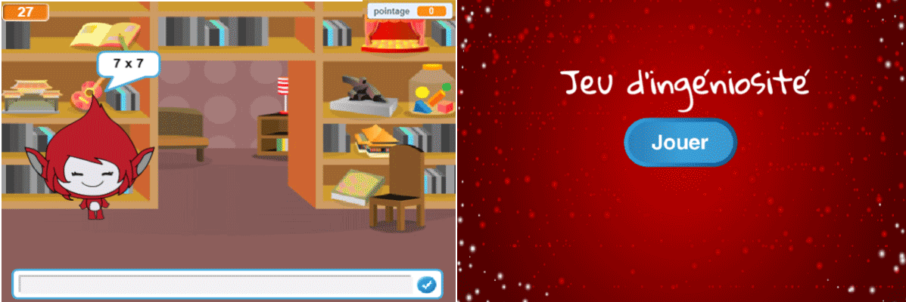

--- challenge ---
## Défi : Écran du début
Pouvez-vous ajouter un autre arrière-plan à votre scène? Il deviendra l'écran d'accueil de votre jeu. Vous pouvez utiliser les blocs ` quand je reçois début ` {.blockevents} et ` quand je reçois fin` {.blockevents} pour passer d'un arrière-plan à l'autre. 

Vous pouvez aussi montrer et cacher votre personnage ainsi que votre minuterie, en utilisant ces blocs :
```blocks
montrer la variable [time v]
```
```blocks
cacher la variable [time v]
```




--- /challenge ---