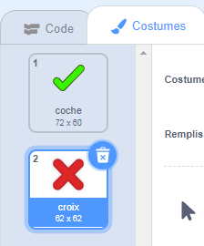
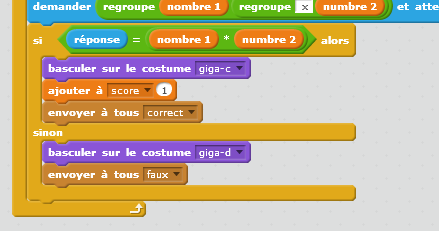
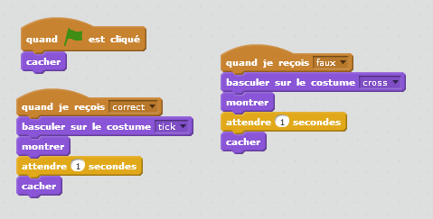
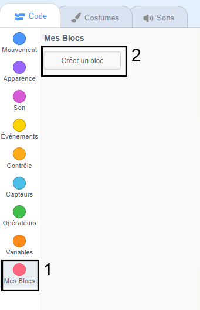
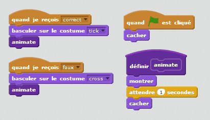

## Ajout de graphisme

Au lieu que ton personnage dise simplement ` oui! :) ` ou ` non :( ` au joueur, ajoutons quelques éléments graphiques qui permettront au joueur de savoir comment il répond.

+ Créez un nouveau lutin appelé 'Résultats', contenant à la fois un costume 'tic' et 'croix'.
    
    

+ Changez le code de votre personnage, de sorte que, il diffuse les messages {: class = "blockevents"} ` correct ` et {: class = "blockevents"} ` faux ` à la place.
    
    

+ Vous pouvez maintenant utiliser ces messages pour montrer le costume «tic» ou «croix». Ajoutez ce code à votre nouveau lutin "Résultat":
    
    

+ Testez votre jeu à nouveau. Vous devriez voir une coche chaque fois que vous obtenez une question correcte, et une croix chaque fois que vous vous trompez!
    
    

+ Avez-vous remarqué que le code pour {: class = "blockevents"} ` quand je reçois correct ` et {: class = "blockevents"} ` quand je reçois faux ` est presque identique? Créons une fonction pour faciliter la modification de votre code.
    
    Sur votre sprite "Résultat", cliquez sur {: class = "blockmoreblocks"} ` Ajouter blocs ` , puis "créer un bloc". Créer une nouvelle fonction appelée ` animer ` {: class = "blockmoreblocks"}.
    
    

+ Vous pouvez ensuite ajouter le code d'animation dans votre nouvelle fonction d'animation, puis utilisez simplement la fonction deux fois:
    
    

+ Maintenant, si vous voulez afficher la coche et la croix pour un temps plus ou moins long, il vous suffit d'apporter une modification à votre code. Essayez !

+ Au lieu de simplement afficher et masquer le tick et la croix, vous pouvez changer votre fonction d'animation, de sorte que les graphiques s'affichent progressivement.
    
    ```blocks
        définir [animer]
        mettre l'effet [fantôme] à (100)
        montrer
        répéter (25) fois
           ajouter a l'effet [fantôme] (-4)
        stop [tout v]
        cacher
    ```