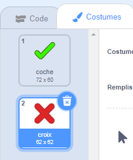
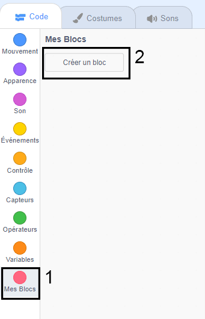
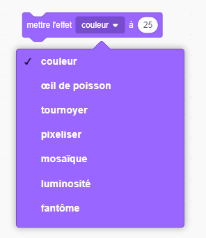

## Ajouter des graphiques

Pour le moment, le sprite personnage dit seulement `oui! :)` ou `non :(` aux réponses du joueur. Ajoute des graphiques pour indiquer au joueur si sa réponse est correcte ou incorrecte.

--- task ---

Crée une nouveau sprite appelé "Résultat" et donne-lui un "cocher / vérifier" et un costume "croix".



--- /task ---

--- task ---

Modifie le code de ton sprite personnage de sorte que, au lieu de dire quelque chose au joueur, il `envoyer à tous`{:class="block3events"} les messages «correctes» ou «mauvais».


```blocks3
if <(answer) = ((numéro 1) * (numéro 2))> then 
- say [oui! :)] for (2) seconds
+ broadcast (correctes v)
else 
- say [non :(] for (2) seconds
+ broadcast (mauvais v)
end
```

--- /task ---

--- task ---

Maintenant , tu peux utiliser ces messages à `montrer`{:class="block3looks"} le costume 'coche' ou 'croix'. Ajoute le code suivant au sprite 'Résultat':


```blocks3
when I receive [correctes v]
switch costume to (coche v)
show
wait (1) seconds
hide

when I receive [mauvais v]
switch costume to (croix v)
show
wait (1) seconds
hide

when flag clicked
hide
```

--- /task ---

--- task ---

Teste à nouveau ton jeu. Tu devrais voir la coche chaque fois que tu réponds correctement à une question et la croix lorsque tu réponds incorrectement!


--- /task ---

Peux-tu voir que le code pour `quand je reçois correctes`{:class="block3events"} et `quand je reçois mauvais`{:class="block3events"} est presque identique?

Pour modifier ton code plus facilement, tu vas créer un bloc personnalisé.

--- task ---

Sélectionne le sprite 'Résultat'. Clique ensuite sur `Mes Blocs`{:class="block3myblocks"}, puis sur **Créer un Bloc**. Crée un nouveau bloc et appelle-le `animer`{:class="block3myblocks"}.




--- /task ---

--- task ---

Déplace le code sur `montrer`{:class="block3looks"} et `masquer`{:class="block3looks"} le sprite "Résultat" dans le bloc `animer`{:class="block3myblocks"}:


```blocks3
define animer
show
wait (1) seconds
hide
```

--- /task ---

--- task ---

Assure-toi que tu as supprimé les blocs `montrer`{:class="block3looks"} et `masquer`{:class="block3looks"} en dessous de **tout les deux** des blocs `basculer sur le costume`{:class="block3looks"}.

Ajoute ensuite le bloc `animer`{:class="block3myblocks"} sous les deux blocs de `basculer sur le costume`{:class="block3looks"}. Ton code devrait maintenant ressembler à ceci:


```blocks3
when I receive [correctes v]
switch costume to (coche v)
animer :: custom

when I receive [mauvais v]
switch costume to (croix v)
animer :: custom
```

--- /task ---

En raison du bloc personnalisé `animer`{:class="block3myblocks"}, il te suffit maintenant de modifier ton code si tu souhaites montrer les costumes du sprite "Résultat" plus ou moins longtemps.

--- task ---

Change ton code pour que les costumes "coche" ou "croix" s'affichent pendant 2 secondes.

--- /task ---

--- task ---

Au lieu de `montrant`{:class="block3looks"} et `masquant`{:class="block3looks"} les costumes "coche" ou "croix", tu peux changer ton bloc`animer`{:class="block3myblocks"} pour que les costumes disparaissent.


```blocks3
define animer
set [fantôme v] effect to (100)
show
repeat (25) 
  change [fantôme v] effect by (-4)
end
hide
```

--- /task ---

Peux-tu améliorer l'animation des graphiques "coche" ou "croix"? Tu peux également ajouter du code pour faire disparaître les costumes ou utiliser d'autres effets sympas:

