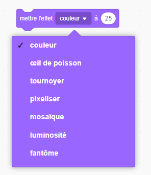

## Ajouter des graphiques

Pour le moment, le sprite personnage dit seulement `oui! :)` ou `non :(` aux réponses du joueur. Ajoute des graphiques pour indiquer au joueur si sa réponse est correcte ou incorrecte.

\--- task \---

Crée une nouveau sprite appelé "Résultat" et donne-lui un "cocher / vérifier" et un costume "croix".


\--- /task \---

\--- task \---

Modifie le code de ton sprite personnage de sorte que, au lieu de dire quelque chose au joueur, il `envoyer à tous`{:class=« block3events»} les messages « correct » ou « mauvais ».


```blocks3
si <(réponse) = ((numéro 1) * (numéro 2))> alors

- dites [oui! :)] pendant (2) secondes
+ envoyer à tous (correct v)
sinon
- dire [non :(] pendant (2) secondes
+ envoyer à tous (mauvais v)
fin
```

\--- /task \---

\--- task \---

Maintenant , tu peux utiliser ces messages à `montrer`{:class="block3looks"} le costume 'coche' ou 'croix'. Ajoute le code suivant au sprite 'Résultat':


```blocks3
    quand je reçois [correct v]
    basculer sur le costume (coche v)
    montrer
    attendre (1) secondes
    cacher

    quand je reçois [faux v]
    basculer sur le costume (croix v)
    montrer
    attendre (1) seconde
    masquer

    lorsque le drapeau est cliqué
    masquer
```

\--- /task \---

\--- task \---

Test your game again. You should see the tick whenever you answer a question correctly, and the cross whenever you answer incorrectly!


\--- /task \---

Can you see that the code for `when I receive correct`{:class="block3events"} and `when I receive wrong`{:class="block3events"} is nearly identical?

So you can change your code more easily, you are going to create a custom block.

\--- task \---

Select the 'Result' sprite. Then click on `My Blocks`{:class="block3myblocks"}, and then on **Make a Block**. Create a new block and call it `animate`{:class="block3myblocks"}.


\--- /task \---

\--- task \---

Move the code to `show`{:class="block3looks"} and `hide`{:class="block3looks"} the 'Result' sprite into the `animate`{:class="block3myblocks"} block:


```blocks3
définir animer
montrer
attendre (1) secondes
masquer
```

\--- /task \---

\--- task \---

Make sure you have removed the `show`{:class="block3looks"} and `hide`{:class="block3looks"} blocks below **both** of the `switch costume`{:class="block3looks"} blocks.

Then add the `animate`{:class="block3myblocks"} block below both of the `switch costume`{:class="block3looks"} blocks. Your code should now look like this:


```blocks3
    lorsque je reçois [correct v]
    basculer sur le costume (coche v)
    animer :: personnalisé

    lorsque je reçois [faux v]
    basculer sur le costume (croix v)
    animer :: personnalisé
```

\--- /task \---

Because of the custom `animate`{:class="block3myblocks"} block, you now only need to make one change to your code if you want to show the 'Result' sprite's costumes a longer or shorter time.

\--- task \---

Change your code so that the 'tick' or 'cross' costumes display for 2 seconds.

\--- /task \---

\--- task \---

Instead of `showing`{:class="block3looks"} and `hiding`{:class="block3looks"} the 'tick' or 'cross' costumes, you could change your `animate`{:class="block3myblocks"} block so that the costumes fade in.


```blocks3
    définir animer
    définir effet [fantôme] sur (100)
    montrer
    répéter (25)
        changer effet [fantôme] sur (-4)
    fin
    cacher
```

\--- /task \---

Can you improve the animation of the 'tick' or 'cross' graphics? You could add code to make the costumes fade out as well, or you could use other cool effects:

