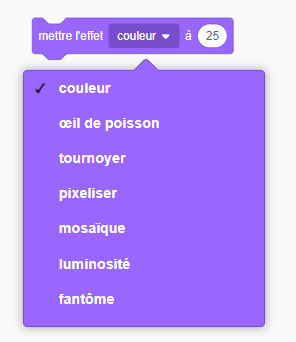

\--- défi \---

## Défi: Animation améliorée

Pouvez-vous améliorer l'animation de vos graphiques? Vous pouvez coder la tique et la croix de sorte qu'elles disparaissent en fondu. Ou vous pouvez utiliser d'autres effets sympas:

\--- /défi \---