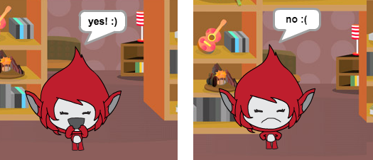

## האתגר: להוסיף ציון ותגובות

אתה יכול להוסיף ניקוד למשחק שלך?

אתה יכול להוסיף קוד כך שחקן ציונים נקודה עבור כל תשובה נכונה. אם אתה מרגיש מתכוון, אתה יכול גם להוסיף קוד לאפס את הציון של השחקן לאפס אם הם נותנים תשובה שגויה!

[[[generic-scratch3-high-score]]]

האם אתה יכול להפוך את הדמות שלך להגיב על התשובה של השחקן על ידי שינוי תחפושת אחרת אם התשובה נכונה או לא נכונה?

