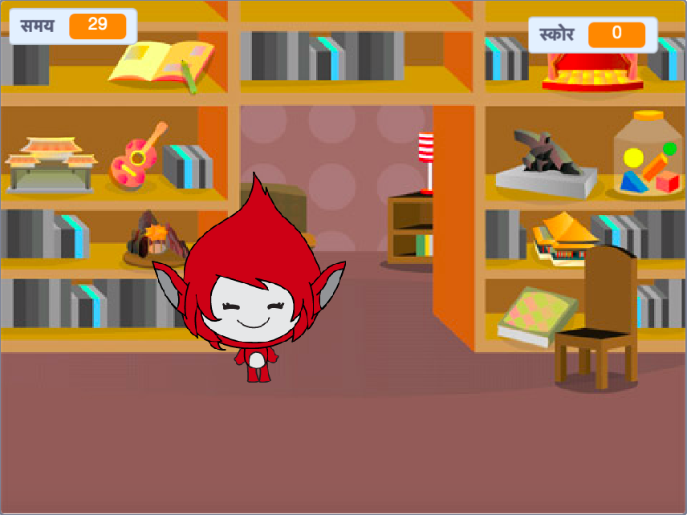

\--- no-print \---

यह प्रोजेक्ट का **स्क्रैच 3** संस्करण है। प्रोजेक्ट का एक [स्क्रैच 2](https://projects.raspberrypi.org/en/projects/brain-game-scratch2) संस्करण भी है।

\--- /no-print \---

## परिचय

इस परियोजना में आप एक गणित क्विज गेम बनाएंगे जिसमें खिलाड़ी के पास यथासंभव सही उत्तर देने के लिए ३० सेकंड का समय होगा।

### आप क्या बनाएँगे

\--- no-print \---

Click the button to start. Type in the answer to the question, and then press the <kbd>Enter</kbd> key.

  <iframe allowtransparency="true" width="485" height="402" src="https://scratch.mit.edu/projects/embed/250234955/?autostart=false" frameborder="0" scrolling="no"></iframe>
  

\--- /no-print \---

\--- print-only \---

\--- /print-only \---

## \--- collapse \---

## title: आप क्या सीखेंगे

+ स्क्रैच में प्रसारण का उपयोग कैसे करें
+ कस्टम स्क्रैच ब्लॉक कैसे बनाएं और इसका उपयोग कैसे करें

\--- /collapse \---

## \--- collapse \---

## title: आपको किन चीज़ों की आवश्यकता होगी

### हार्डवेयर

+ स्क्रैच 3 चलाने में सक्षम कंप्यूटर

### सॉफ्टवेयर

+ स्क्रैच 3 ([ऑनलाइन ](http://rpf.io/scratchon){:target="_blank"} या फिर [ऑफ़्लाइन](http://rpf.io/scratchoff){:target="_blank"})

\--- /collapse \---

## \--- collapse \---

## title: शिक्षकों के लिए अतिरिक्त टिप्पणियाँ

\--- no-print \---

If you need to print this project, please use the [printer-friendly version](https://projects.raspberrypi.org/en/projects/brain-game/print).

\--- /no-print \---

You can find the [completed project here](http://rpf.io/p/en/brain-game-get){:target="_blank"}.

\--- /collapse \---