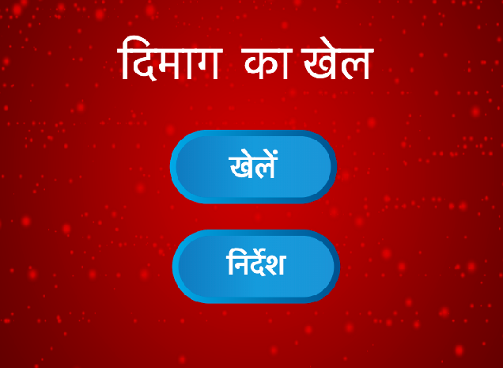

## चुनौती: निर्देश पटल

क्या आप एक निर्देश पटल (स्क्रीन) जोड़ सकते हैं जो खिलाड़ी को खेल खेलने का तरीका बताये? इसके लिए आपको एक 'निर्देश' बटन, और दूसरा स्टेज पृष्ठभूमि चाहिए।



आपको एक 'वापस जायें' बटन भी लगाने की आवश्यकता हो सकती है जो खिलाड़ी को प्रारम्भिक पटल पर वापस जाने देता है।

```blocks3
    प्रसारित करें (प्रारम्भ पटल v)
```