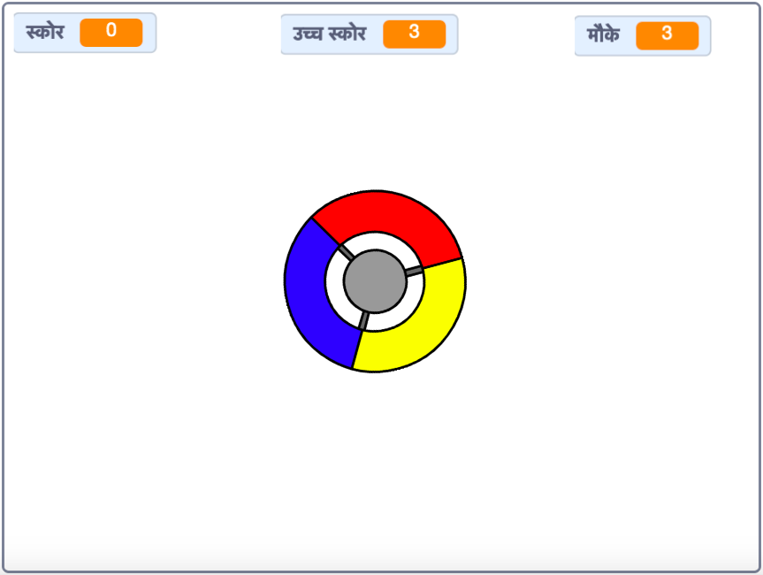

## आगे क्या?

प्रतिक्रिया गेम बनाने के लिए [ डॉट्स को पकड़ें ](https://projects.raspberrypi.org/en/projects/catch-the-dots?utm_source=pathway&utm_medium=whatnext&utm_campaign=projects) प्रोजेक्ट खेलें! उस परियोजना में, आप सीखेंगे कि स्प्राइट के क्लोन कैसे बनाए जाते हैं, और धीरे-धीरे खेल को गति देने के लिए एक चर का उपयोग कैसे करें।

\--- no-print \---

Use the arrow keys on your keyboard to rotate the controller wheel and catch the flying dots as they reach the centre. If you miss three dots, the game is over.

  <iframe allowtransparency="true" width="485" height="402" src="https://scratch.mit.edu/projects/embed/252923761/?autostart=false" frameborder="0" scrolling="no"></iframe>
  

\--- /no-print \---

\--- print-only \---

\--- /print-only \---