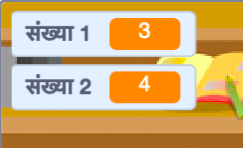

## प्रश्न बनाना

आप ऐसे यादृच्छिक प्रश्न बनाकर शुरू करेंगे जिनका खिलाड़ी को जवाब देना है।

\--- task \---

एक नया स्क्रैच प्रोजेक्ट खोलें।

** ऑनलाइन: ** [ rpf.io/scratch-new ](http://rpf.io/scratch-new) पर एक नया ऑनलाइन स्क्रैच प्रोजेक्ट खोलें {: लक्ष्य = "_ blank"}।

** ऑफ़लाइन: ** ऑफ़लाइन संपादक में एक नया प्रोजेक्ट खोलें।

यदि आपको स्क्रैच ऑफ़लाइन संपादक को डाउनलोड और इंस्टॉल करने की आवश्यकता है, तो आप इसे [rpf.io/scratchoff](http://rpf.io/scratchoff) {:target="_blank"} पर पा सकते हैं।

\--- /task \---

\--- कार्य \--- अपने खेल के लिए चरित्र स्प्राइट और एक पृष्ठभूमि जोड़ें। आप अपनी पसंद का कोई भी चुन सकते हैं! यहाँ एक उदाहरण है:


\--- /task \---

\--- task \--- सुनिश्चित करें कि आपका चरित्र स्प्राइट चयनित है। Create two new variables, called `number 1`{:class="block3variables"} and `number 2`{:class="block3variables"}, to store the numbers for the quiz questions.

 

[[[generic-scratch3-add-variable]]]

\--- /task \---

\--- task \--- दोनों <०> चरों </code> {<class> "block3variables"} का मान 2 और 12 के बीच एक ` यादृच्छिक ` {"class =" block3operators "} संख्या निर्धारित करने के लिए कोड लिखें।


```blocks3
जब झंडा क्लिक किया
[संख्या 1 v] को (यादृच्छिक (2) से (12) के बीच चुने) स्थिर करें 
[संख्या 2 v] को (यादृच्छिक (2) से (12) के बीच चुने) स्थिर करें
```

\--- /task \---

\--- task \--- खिलाड़ी से उत्तर पूछने के लिए `पूछें`{:class="block3sensing"} और बताने के लिए कि उत्तर सही था या नही, `2 सेकंड के लिए कहें`{:class="block3looks"} कोड जोड़ें।


```blocks3
जब झंडा क्लिक किया
[संख्या 1 v] को (यादृच्छिक (2) से (12) के बीच चुने) स्थिर करें 
[संख्या 2 v] को (यादृच्छिक (2) से (12) के बीच चुने) स्थिर करें

+ पूछें (जोड़ें (संख्या 1) (जोड़ें [x] (संख्या 2))) और प्रतीक्षा करें 
+ यदि <(उत्तर) = ((संख्या 1) * (संख्या 2))> तो
+ कहें [हाँ! :)] for (2) seconds
+ else
+ say [no :(] for (2) seconds
+ end
```

\--- /task \---

\--- task \---

Test your project twice: answer one question correctly, and the other incorrectly.

\--- /task \---

\--- task \---

Add a `forever`{:class="block3control"} loop around this code, so that the game asks the player lots of questions in a row.

\--- hints \--- \--- hint \---

You need to add a `forever`{:class="block3control"} block, and put all of the code except the `when flag clicked`{:class="block3control"} block into it.

\--- /hint \--- \--- hint \--- Here is the block you need:

```blocks3
forever
end
```

\--- /hint \--- \--- hint \--- Here is what your code should look like:

```blocks3
when flag clicked

+ forever
    set [number 1 v] to (pick random (2) to (12))
    set [number 2 v] to (pick random (2) to (12))
    ask (join (number 1)(join [ x ] (number 2))) and wait
    if <(answer) = ((number 1)*(number 2))> then
        say [yes! :)] for (2) seconds
    else
        say [no :(] for (2) seconds
    end
end
```

\--- /hint \--- \--- /hints \---

\--- /task \---