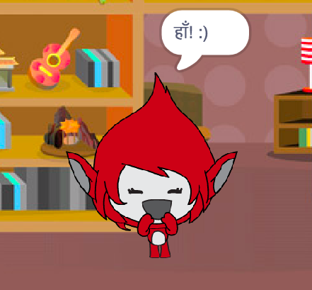

## चुनौती: स्कोर जोड़ना

क्या आप अपने खेल में स्कोर जोड़ सकते हैं?

आप कोड जोड़ सकते हैं ताकि खिलाड़ी हर सही उत्तर के लिए एक अंक बनाए। यदि आप कुछ कमी महसूस कर रहे हैं, तो आप गलत उत्तर देने पर खिलाड़ी के स्कोर को फिर से शून्य पर स्थिर करने के लिए भी कोड जोड़ सकते हैं!

[[[generic-scratch3-high-score]]]

यदि उत्तर सही या गलत है तो क्या आप अपने पात्र को एक अलग वेशभूषा में बदलकर खिलाड़ी के जवाब पर प्रतिक्रिया कर सकते हैं?

