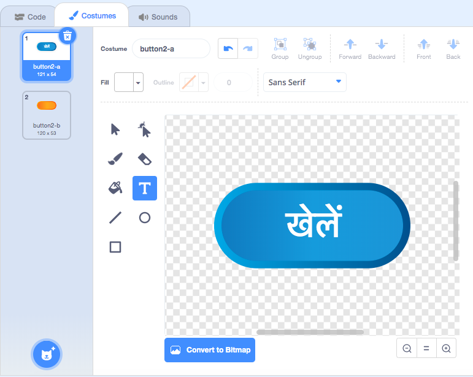
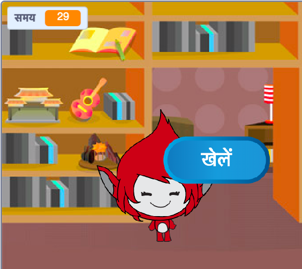
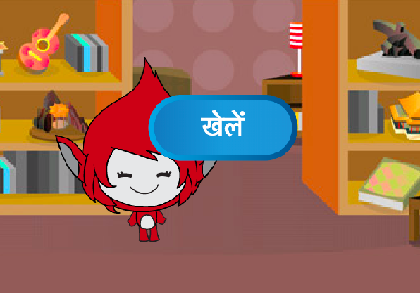

## मल्टीप्ल गेम्ज़

चलिए आपकी गेम में 'Play' बटन जोड़ें, ताकि आप कई बार खेल सकें।

\--- task \---

एक नया 'Play' बटन स्प्राइट बनाएं जो खिलाड़ी को नया गेम चालू करने के लिए क्लिक करना पड़ेगा।

आप या अपने आप एक स्प्राइट बना सकते है, या फिर लाइब्रेरी से एक स्प्राइट चुनके अपने हिसाब बदल सकते है।



\--- /task \---

\--- task \---

इस कोड को अपने स्प्राइट में जोड़ें:


```blocks3
    when flag clicked
    show

    when this sprite clicked
    hide
    broadcast (start v)
```

\--- /task \---

नए कोड में एक और `broadcast`{:class="block3events"} ब्लॉक शामिल है, जो 'start' संदेश भेजता है।

इस कोड को जोड़ने के बाद, जब एक खिलाडी उस झंडे पर क्लिक करेगा तब एक 'Play' बटन स्प्राइट दिखाया जायेगा। जब खिलाड़ी बटन स्प्राइट पर क्लिक करता है, तो स्प्राइट छिप जाता है और फिर एक संदेश प्रसारित करता है जिस पर अन्य स्प्राइट प्रतिक्रिया कर सकते हैं।

अब, खिलाड़ी के झंडे पर क्लिक करते ही पात्र स्प्राइट सवाल पूछना शुरू कर देता है। अपने गेम के कोड को बदलें ताकि जब पात्र स्प्राइट को 'start' `broadcast`{:class="block3events"} प्राप्त हो तो वो सवाल पूछना शुरू करे।

\--- task \---

अपने पात्र स्प्राइट चुने और, इसके कोड अनुभाग में, `when flag is clicked`{:class="block3events"} ब्लॉक को `when I receive start`{:class="block3events"} ब्लाक से बदल दें।


```blocks3
<br />- when flag clicked
+ when I receive [start v]
set [number 1 v] to (pick random (2) to (12))
set [number 2 v] to (pick random (2) to (12))
ask (join (number 1)(join [ x ] (number 2))) and wait
if <(answer) = ((number 1)*(number 2))> then
    say [yes! :)] for (2) seconds
else
    say [nope :(] for (2) seconds
end
```

\--- /task \---

\--- task \---

हरे झंडे पर क्लिक करें, और फिर यह जाँच करने के लिए कि यह काम कर रहा है, नए 'Play' बटन पर क्लिक करें । आपको यह दिखना चाहिए की आपके बटन ना दबाने तक गेम चालू नहीं होता है।

\--- /task \---

क्या आप देख सकते हैं कि खेल शुरू होने के बजाये, जब हरा झंडा पर क्लिक किया जाता है तब टाइमर शुरू होता है?



\--- task \---

क्या आप टाइमर के लिए कोड बदल सकते हैं ताकि खिलाड़ी के बटन पर क्लिक करने पर टाइमर शुरू हो जाए?

\--- /task \---

\--- task \---

अपने बटन स्प्राइट में कोड जोड़ें ताकि प्रत्येक खेल के अंत में बटन फिर से दिखाई दे।


```blocks3
    when I receive [end v]
    show
```

\--- /task \---

\--- task \---

कुछ गेम खेलकर 'Play' बटन का परीक्षण करें। प्रत्येक खेल के अंत में बटन दिखना चाहिए।

गेम को अधिक तेज़ी से जांचने के लिए, आप `time`{:class="block3variables"} का मूल्य बदल सकते हैं ताकि प्रत्येक खेल केवल कुछ सेकंड लंबा हो।


```blocks3
    set [time v] to [10]
```

\--- /task \---

\--- task \---

आप बटन, जब उसके ऊपर माउस है, का दिखावट भी बदल सकते है।


```blocks3
    when flag clicked
    show
    forever
    if <touching (mouse-pointer v)?> then
        set [fisheye v] effect to (30)
    else
        set [fisheye v] effect to (0)
    end
    end
```



\--- /task \---