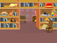

## मल्टीप्ल गेम्ज़

अब आप एक 'खेलें' बटन जोड़ने जा रहे हैं, ताकि खिलाड़ी आपके खेल को कई बार खेल सके।

\--- task \---

Create a new 'Play' button sprite that the player needs to click to start a new game.

You can draw the sprite yourself, or edit a sprite from the library.


\--- /task \---

\--- task \---

Add this code to your button sprite:


```blocks3
    जब ध्वज क्लिक किया
    दिखाएँ

    जब यह स्प्राइट क्लिक किया
    छिपाएँ
    प्रसारण (प्रारंभ v)
```

\--- /task \---

The new code includes another `broadcast`{:class="block3events"} block, which sends the message 'start'.

The new code makes the 'Play' button sprite show when when player clicks on the flag. When the player clicks on the button sprite, the sprite hides and then broadcasts a message that other sprites can react to.

At the moment, the character sprite starts asking questions when the player clicks the flag. Change your game's code so that character sprite starts asking questions when it receives the 'start' `broadcast`{:class="block3events"}.

\--- task \---

Select your character sprite and, in its code section, replace the `when flag clicked`{:class="block3events"} block with a `when I receive start`{:class="block3events"} block.


```blocks3
<br />- जब झंडा क्लिक किया
+ जब मुझे प्राप्त हो [शुरू करें v ]
[संख्या 1 v] को (यादृच्छिक (2) से (12) के बीच चुने) स्थिर करें 
[संख्या 2 v] को (यादृच्छिक (2) से (12) के बीच चुने) स्थिर करें
पूछें (जोड़ें (संख्या 1) (जोड़ें [x] (संख्या 2))) और प्रतीक्षा करें 
यदि <(उत्तर) = ((संख्या 1) * (संख्या 2))> तो
   कहें [हाँ! :)] (2) सेकंड के लिए
अन्यथा
   कहें [नहीं :(] (2) सेकंड के लिए
अंत
```

\--- /task \---

\--- task \---

Click the green flag, and then click on the new 'Play' button to test whether it works. You should see that the game doesn't start before you click on the button.

\--- /task \---

Can you see that the timer starts when the green flag is clicked, instead of when the game starts?


\--- task \---

Can you change the code for the timer so that the timer starts when the player clicks on the button?

\--- /task \---

\--- task \---

Add code to your button sprite so that the button shows again at the end of each game.


```blocks3
    जब मुझे प्राप्त हो [अंत v]
    दिखाएँ
```

\--- /task \---

\--- task \---

Test the 'Play' button by playing a couple of games. The button should show at the end of each game.

To test the game more quickly, you can change the value of `time`{:class="block3variables"} so that each game is only a few seconds long.



```blocks3
    [समय v] को [10] स्थिर करें
```

\--- /task \---

\--- task \---

You can change how the button looks when the mouse pointer hovers over it.


```blocks3
    जब झंडे पर क्लिक किया
    दिखाएँ
    हमेशा के लिए
    यदि <touching (mouse-pointer v)?> तो
       [फ़िश आइ v] प्रभाव को (30) स्थिर करें
    अन्यथा
        [फ़िश आइ v] प्रभाव को (0) स्थिर करें
    अंत
    अंत
```


\--- /task \---