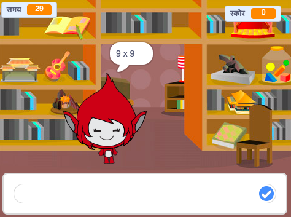

## चुनौती: एक प्रारंभ स्क्रीन बनायें

क्या आप एक और पृष्ठभूमि जोड़ सकते हैं जो आपके खेल के लिए प्रारम्भ स्क्रीन होगी?

आप पृष्ठभूमि बदलने के लिए `जब मुझे प्रारम्भ प्राप्त हो`{:class="block3events"} `जब मुझे अंत प्राप्त हो`{:class="block3events"} ब्लॉक्स का इस्तेमाल कर सकते हैं।

जब आपका खेल चरित्र को छुपाने या दिखाने के लिए पृष्ठभूमि बदलता है तो आप `दिखाएँ`{:class="block3looks"} और `छुपाएँ`{:class="block3looks"} ब्लॉक्स का उपयोग कर सकते हैं

जब आपका खेल टाइमर और स्कोर को छुपाने या दिखाने के लिए पृष्ठभूमि बदलता है तो आप `चर दिखाएँ`{:class="block3looks"} और `चर छुपाएँ`{:class="block3looks"} ब्लॉक्स का उपयोग कर सकते हैं।

