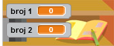

## Izrada pitanja

Počnimo stvaranjem slučajnih pitanja na koja igrači moraju odgovariti.

+ Pokrenite novi Scratch projekt i izbrišite cat sprite kako bi vaš projekt bio prazan. Možete pronaći online Scratch editor aplikacijz na <a href="http://jumpto.cc/scratch-new" target="_blank">jumpto.cc/scratch-new</a>.

+ Odaberite znak i pozadinu za svoju igru. Možete odabrati bilo koju koja vam se sviđa! Na primjer:
    
    

+ Izradite dvije nove varijable nazvane ` number 1 ` {: class = "blockdata"} i ` number 2 ` {: Class = "blockdata"}. Ove varijable će pohraniti 2 broja koji će se pomnožiti zajedno.
    
    

+ Dodajte kôd svojem znaku da biste postavili obje varijable na `random` {: class = "blockoperators"} broj između 2 i 12.
    
    ```blocks
        when flag clicked
        set [number 1 v] to (pick random (2) to (12))
        set [number 2 v] to (pick random (2) to (12))
    ```

+ Zatim možete zatražiti od igrača odgovor i obavijestiti ih jesu li bili u pravu ili u krivu.
    
    ```blocks
        when flag clicked
        set [number 1 v] to (pick random (2) to (12))
        set [number 2 v] to (pick random (2) to (12))
        ask (join (number 1)(join [ x ] (number 2))) and wait
        if <(answer) = ((number 1)*(number 2))> then
            say [yes! :)] for (2) secs
        else
            say [nope :(] for (2) secs
        end
    ```

+ Testirajte svoj projekt u potpunosti, odgovarajući na jedno pitanje točno i jedno s pogrešnim odgovorom.

+ Dodaj `forever` {: class = "blockcontrol"} petlju oko ovog koda, tako da se igraču postavlja puno pitanja.

+ Napravite odbrojavanje na pozornici pomoću varijable pod nazivom `time` {:class = "blockdata"}. Projekt "Ghostbusters" sadrži upute za izradu mjerača vremena (u koraku 5) ukoliko vam je potrebna pomoć!

+ Ponovno testirajte svoj projekt - trebali biste nastaviti s postavljanjem pitanja dok ne istekne vrijeme.