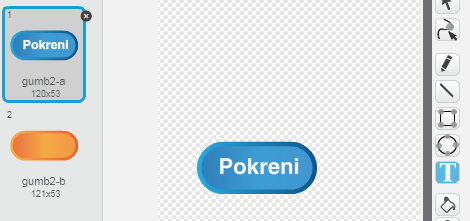
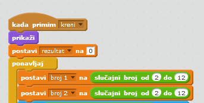
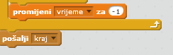

## Više igara

Želiš li igrati igru više puta, možeš dodati gumb 'Pokreni'.

+ Dodaj lik gumba iz biblioteke likova (možeš ga i nacrtati) na kojeg će igrač kliknuti kako bi pokrenuo novu igru. U kostimima dodaj na gumb tekst 'Pokreni'.
    
    

+ Gumbu dodaj sljedeće naredbe:
    
    ```blocks
        kada je zastavica kliknut
    prikaži
    
    kada je lik kliknut
    sakrij
    pošalji [kreni v]
    ```
    
    Ovaj kôd će prikazati gumb 'Pokreni' kada se projekt pokrene. Kada igrač klikne na njega, gumb nestaje i šalje se poruka koja će pokrenuti igru.

+ Promijeni kôd svog lika tako da igra započne kada on dobije poruku `kreni`{:class="blockevents"}, a ne kada je zastavica kliknuta.
    
    Zamijenite `when flag clicked` {:class="blockevents"} kod sa `when I receive start` {:class="blockevents"}.
    
    

+ Klikni na zelenu zastavicu, a zatim na gumb 'Pokreni' i isprobaj program. Vidjet ćeš da igra ne počinje sve dok igrač ne klikne na gumb.

+ Primjećuješ li da odbrojavanje počinje kada se klikne zelena zastavica, a ne kada počne igra?
    
    
    
    Možeš li to popraviti?

+ Klikni na pozornicu i zamijeni naredbu `zaustavi sve`{:class="blockcontrol"} porukom `kraj`{:class="blockevents"}.
    
    

+ Sada dodaj sljedeće naredbe svome gumbu kako bi se na kraju igre ponovno prikazao.
    
    ```blocks
        kada primim [kraj v]
    prikaži
    ```

+ Sljedećim naredbama postići ćeš da lik na kraju igre prestane postavljati pitanja:
    
    ```blocks
        kada primim [kraj v]
    zaustavi [ostale skripte lika v]
    ```

+ Isprobaj gumb 'Pokreni' tako što ćeš odigrati igricu nekoliko puta. Primijetit ćeš da se gumb ponovno prikazuje nakon svake igre. Kako bi testiranje bilo lakše, možeš skratiti trajanje igre ​​tako da traje samo nekoliko sekundi.
    
    ```blocks
        postavi [vrijeme v] na [10]
    ```

+ Možeš čak i promijeniti izgled gumba kada miš prijeđe preko njega.
    
    ```blocks
        when flag clicked
        show
        forever
        if <touching [mouse-pointer v]?> then
            set [fisheye v] effect to (30)
        else
            set [fisheye v] effect to (0)
        end
        end
    ```
    
    