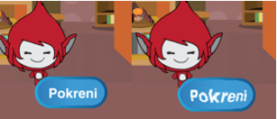

## Više igara

Krenimo sa dodavanjem gumba "play" u igru, tako da je možete igrati mnogo puta.

+ Izradite novi gumb "Igraj", koji će vaš igrač kliknuti za početak nove igre. Možete ga sami nacrtati, ili urediti sprite iz Scratch knjižnice.
    
    

+ Dodajte ovaj kôd na svoj novi gumb.
    
    ```blocks
        when flag clicked
        show
    
        when this sprite clicked
        hide
        broadcast [start v]
    ```
    
    Ovaj kôd prikazuje igraj gumb kada je vaš projekt pokrenut. Kada kliknete gumb, skriva se i zatim emitira poruku koja će pokrenuti igru.

+ Morat ćete urediti kôd svog znaka, tako da igra započinje kada dobiju `start` {:class="blockevents"}, a ne kada kliknete na zastavu.
    
    Zamijenite `when flag clicked` {:class="blockevents"} kod sa `when I receive start` {:class="blockevents"}.
    
    

+ Kliknite na zelenu zastavu, a zatim kliknite svoj novi igraj gumb biste je testirali. Trebali biste vidjeti da se igra ne počinje dok se ne klikne na gumb.

+ Jeste li primijetili da brojač počinje kada se klikne na zelenu zastavu, a ne kada počne igra?
    
    
    
    Možete li rješiti ovaj problem?

+ Kliknite na pozornicu i zamijenite `stop all` {:class="blockcontrol"} blok sa `end` {:class="blockevents"} poruku.
    
    

+ Sada možete dodati kôd na vaš gumb, da biste ga ponovno prikazali na kraju svake igre.
    
    ```blocks
        when I receive [end v]
        show
    ```

+ Također ćete morati zaustaviti svoj znak postavljanjem pitanja na kraju svake igre:
    
    ```blocks
        when I receive [end v]
        stop [other scripts in sprite v]
    ```

+ Testirajte vaš igraj gumb igranjem nekoliko igara. Trebali biste primijetiti da se igraj gumb prikazuje nakon svake igre. Da biste olakšali testiranje, možete skratiti svaku igru, ​​tako da traje samo nekoliko sekundi.
    
    ```blocks
        set [time v] to [10]
    ```

+ Čak možete promijeniti i način na koji gumb izgleda kada mišem prijeđete preko njega.
    
    ```blocks
        when flag clicked
        show
        forever
        if <touching [mouse-pointer v]?> then
            set [fisheye v] effect to (30)
        else
            set [fisheye v] effect to (0)
        end
        end
    ```
    
    