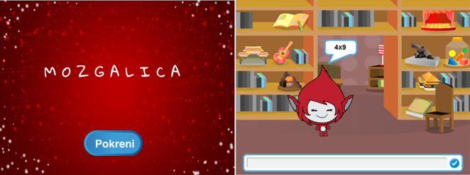

\--- challenge \---

## Izazov: Početni zaslon

Možete li dodati još jednu pozadinu na pozornicu? Ona će biti početni zaslon tvoje igre. Za promjenu pozadina možeš koristiti naredbe `kada primim kreni`{:class="blockevents"} i `kada primim kraj`{:class="blockevents"}.

Također možeš prikazati ili sakriti svog lika pa čak i prikazati ili sakriti brojač vremena koristeći ove naredbe:

```blocks
prikaži varijablu [vrijeme v]
```

```blocks
sakrij varijablu [vrijeme v]
```



\--- /challenge \---