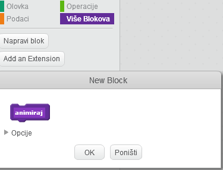

## Dodavanje grafike

Umjesto vašeg znaka samo govori `yes! :)` ili `nope :(` igraču, dodajmo neke grafike koje će omogućiti igraču informaciju o napretku.

+ Napravite novi sprite zvan 'Rezultat', koji sadrži i 'kvačicu' i 'križ' kostim.
    
    

+ Promijenite kôd svog znaka, tako da umjesto da govori igraču kako napreduje, on emitira `correct`{:class="blockevents"} i `wrong`{:class="blockevents"} umjesto poruke.
    
    

+ Sada možete upotrijebiti poruke za prikazivanje kostima "kvačicu" ili "križa". Dodajte ovaj kôd na novi sprite "Rezultat":
    
    

+ Ponovno provjerite svoju igru. Trebali biste vidjeti kvačicu svaki put kad dobijete točno pitanje, i križ svaki put kad dobijete pogrešno!
    
    

+ Primijetili ste da je kôd za `when I receive correct`{:class="blockevents"} i `when I receive wrong`{:class="blockevents"} je gotovo identičan? Izradimo funkciju kako bismo vam olakšali izmjenu vašeg koda.
    
    Na sprite "Rezultat" kliknite `More Blocks`{:class="blockmoreblocks"}, a zatim 'Izradi blok'. Stvorite novu funkciju pod nazivom `animate`{:class="blockmoreblocks"}.
    
    

+ Zatim možete dodati kôd animacije u svoju novu animacijsku funkciju, a zatim dvaput upotrijebiti funkciju:
    
    

+ Sada, ako želite pokazati kvačicu i križ duže ili kraće vrijeme, samo trebate napraviti jednu promjenu u kodu. Probaj!

+ Umjesto da samo prikazujete i skrivate kvačicu i križ, možete promijeniti svoju animacijsku funkciju, tako da grafika nestaje.
    
    ```blocks
        define [animate]
        set [ghost v] effect to (100)
        show
        repeat (25)
            change [ghost v] effect by (-4)
        end
        hide
    ```