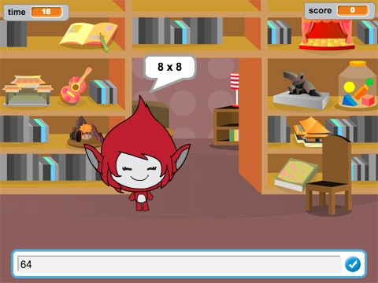

\--- no-print \---

Ez a projekt **Scratch 3** verziója. Van is egy [Scratch 2 változata a projekt](https://projects.raspberrypi.org/en/projects/brain-game-scratch2).

\--- / nincs nyomtatás \---

## Bevezetés

Ebben a projektben létrehoz egy matematikai kvíz játékot, amelyben a játékosnak 30 másodperc van, hogy minél több helyes választ adjon.

### Mit fogsz tenni

\--- no-print \--- Kattintson a gombra az indításhoz. Írja be a választ a kérdésre, majd nyomja meg az <kbd>Enter</kbd> gombot.

  <iframe allowtransparency="true" width="485" height="402" src="https://scratch.mit.edu/projects/embed/250234955/?autostart=false" frameborder="0" scrolling="no"></iframe>
  

\--- / nincs nyomtatás \---

\--- csak nyomtatás \---  \--- csak nyomtatás \---

## \--- összeomlás \---

## title: Mit tanulni fog

+ Hogyan használjuk a Scratch-adásokat
+ Egyéni Scratch blokk létrehozása és használata

\--- / összeomlás \---

## \--- összeomlás \---

## title: Amire szüksége lesz

### Hardver

+ A Scratch 3 futtatására alkalmas számítógép

### Szoftver

+ Scratch 3 ( [online](http://rpf.io/scratchon){: target = "_ blank"} vagy [offline](http://rpf.io/scratchoff){: target = "_ blank"})

\--- / összeomlás \---

## \--- összeomlás \---

## title: További megjegyzések az oktatók számára

\--- no-print \--- Ha ki kell nyomtatnia ezt a projektet, kérjük, használja az [nyomtatóbarát változat](https://projects.raspberrypi.org/en/projects/brain-game/print). \--- / nincs nyomtatás \---

Keresse meg a [megoldást erre a projektre](http://rpf.io/p/en/brain-game-get){: target = "_ blank"}.

\--- / összeomlás \---