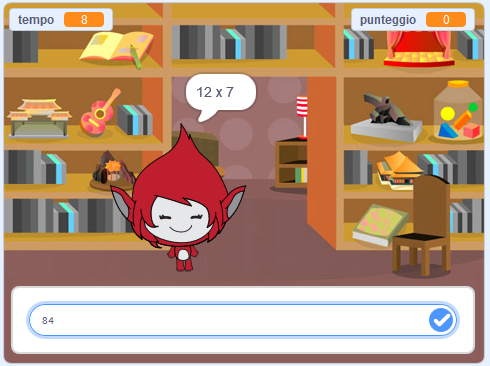

## Introduzione

In questo progetto imparerai come creare un quiz sulle tabelline, in cui dovrai rispondere correttamente al maggior numero di domande possibili in 30 secondi.

  <iframe allowtransparency="true" width="485" height="402" src="https://scratch.mit.edu/projects/embed/42225768/?autostart=false" frameborder="0"></iframe>
  

### Ulteriori informazioni per gli organizzatori dei club

Se intendete stampare questo progetto, cliccate su [Versione stampabile](https://projects.raspberrypi.org/en/projects/brain-game/print).

## \--- collapse \---

## title: Note per i volontari

## Introduzione:

In questo progetto, i bambini impareranno a creare un gioco a quiz sulle tabelline, in cui il giocatore deve rispondere correttamente al maggior numero di domande possibili in 30 secondi.

## Risorse

Per questo progetto, andrebbe usato Scratch 2. Scratch 2 può essere usato online su [jumpto.cc/scratch-on](http://jumpto.cc/scratch-on) oppure può essere scaricato da [jumpto.cc/scratch-off](http://jumpto.cc/scratch-off) ed essere usato in modalità offline.

Una versione completa di questo progetto può essere trovata [online](http://scratch.mit.edu/projects/42225768/#editor), oppure può essere scaricata cliccando il link ‘Materiali del Progetto’, che contiene:

* BrainGame.sb2

## Obiettivi di apprendimento

* Questo progetto consolida l'apprendimento delle abilità di programmazione precedentemente acquisite e mostra come i messaggi possano essere usati per creare un semplice sistema di menù di gioco.

Questo progetto include elementi tratti dalle seguenti componenti del [Digital Making Curriculum di Raspberry Pi](http://rpf.io/curriculum):

* [Combinare i costrutti base di un linguaggio di programmazione per risolvere un problema.](https://www.raspberrypi.org/curriculum/programming/builder)

## Sfide

* "Cambiare i costumi" - cambiare l'aspetto del personaggio del gioco in base al tipo di risposta, corretta o errata, fornita;
* "Aggiunta di un punteggio" - aggiunta di un punto per ogni risposta corretta fornita;
* "Schermata iniziale" - modifica dello sfondo dello stage in risposta ai messaggi `inizio` {:class="blockevents"} e `fine` {:class="blockevents"}, con la creazione di 2 'schermate' di gioco;
* "Animazione migliorata" - utilizzo di circuiti ed effetti per migliorare l'animazione grafica nelle situazioni corrette/errate;
* "Suono e musica" - consolidamento dell'apprendimento dei circuiti musicali e degli effetti sonori;
* "Guadagnare 10 punti" - cambiare la logica del gioco per creare un nuovo obiettivo di gioco;
* "Schermata delle istruzioni" - consolidamento dell'uso dei messaggi per creare un menù di gioco, aggiungendo un nuovo pulsante e la schermata "istruzioni".

\--- /collapse \---

## \--- collapse \---

## title: Materiali del progetto

## Risorse per gli organizzatori del club

* [Progetto Scratch 2 completo scaricabile](resources/BrainGame.sb2)
* [Progetto Scratch 2 completo online](http://scratch.mit.edu/projects/42225768/#editor)

\--- /collapse \---