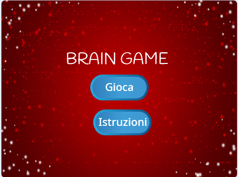

\--- challenge \---

## Sfida: Schermata delle istruzioni

Puoi aggiungere una schermata di istruzioni al tuo gioco, raccontando al tuo giocatore come si gioca? Avrai bisogno di un pulsante "Istruzioni" e di un altro sfondo di stage.



Potrebbe anche essere necessario un pulsante "Indietro" per accedere al menu principale.

```blocks
    invia a tutti [menu principale v]
```

\--- /challenge \---