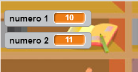

## Creare le domande

Iniziamo creando domande casuali a cui il giocatore deve rispondere.

+ Avvia un nuovo progetto Scratch ed elimina lo sprite a forma di gatto in modo che il tuo progetto sia vuoto. Per creare un nuovo progetto di Scratch usando l'editor online, vai su <a href="http://jumpto.cc/scratch-new" target="_blank">jumpto.cc/scratch-new</a>.

+ Scegli un personaggio e uno sfondo per il tuo gioco. Puoi scegliere quello che più ti piace! Ecco un esempio:
    
    

+ Crea 2 nuove variabili chiamate `numero 1`{:class="blockdata"} e `numero 2`{:class="blockdata"}. Queste variabili memorizzeranno i 2 numeri che verranno moltiplicati tra loro.
    
    

+ Aggiungi del codice al tuo personaggio in modo da impostare entrambe le variabili su un valore `a caso`{:class="blockoperators"} compreso tra 2 e 12.
    
    ```blocks
    quando si clicca su ⚑
    porta [numero 1 v] a (numero a caso tra (2) e (12))
    porta [numero 2 v] a (numero a caso tra (2) e (12))
```

+ Puoi quindi chiedere al giocatore qual è la risposta, e fargli/farle sapere se la risposta inserita è corretta o sbagliata.
    
    ```blocks
    quando si clicca su ⚑
    porta [numero 1 v] a (numero a caso tra (2) e (12))
    porta [numero 2 v] a (numero a caso tra (2) e (12))
    chiedi (unione di (numero 1) e (unione di [ x ] e (numero 2))) e attendi 
    se <(risposta) = ((numero 1)*(numero 2))> allora 
        dire [sì! :)] per (2) secondi
    altrimenti
        dire [no :(] per (2) secondi
    fine
```

+ Metti alla prova il tuo progetto completamente, rispondendo a una domanda correttamente e ad un'altra con la risposta sbagliata.

+ Aggiungi un circuito `per sempre`{:class="blockcontrol"}, in modo che al giocatore vengano poste molte domande.

+ Crea un timer per il conto alla rovescia sullo stage, usando una variabile chiamata `tempo`{:class="blockdata"}. Se hai bisogno di aiuto, il progetto 'Ghostbusters' contiene istruzioni su come creare un timer (al passaggio 5)!

+ Metti alla prova di nuovo il tuo progetto - dovresti essere in grado di continuare a porre domande fino al termine del tempo.