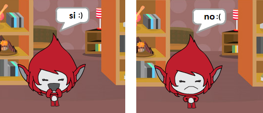

## Sfida: aggiungi un punteggio e reazioni

Puoi aggiungere un punteggio al tuo gioco?

È possibile aggiungere codice in modo che il giocatore guadagni un punto per ogni risposta corretta. Se ti senti cattivo, puoi anche aggiungere del codice per azzerare il punteggio del giocatore se danno una risposta sbagliata!

[[[generic-scratch3-high-score]]]

Puoi far reagire il tuo personaggio alla risposta del giocatore cambiando in un costume diverso se la risposta è corretta o errata?

