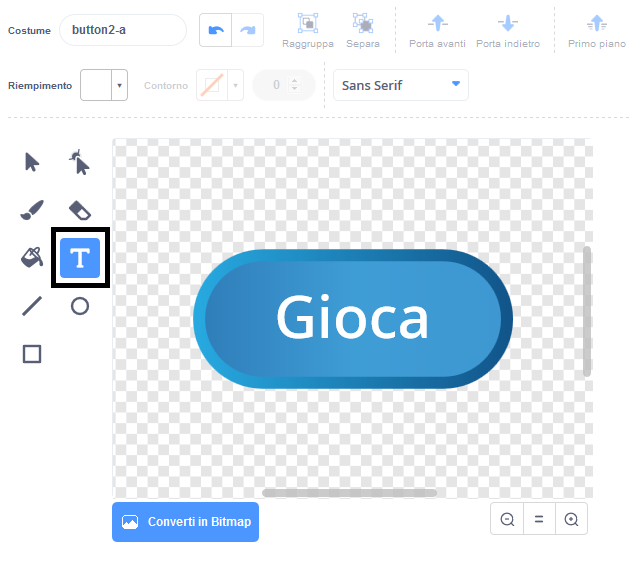
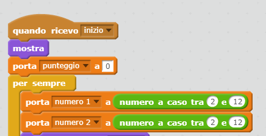
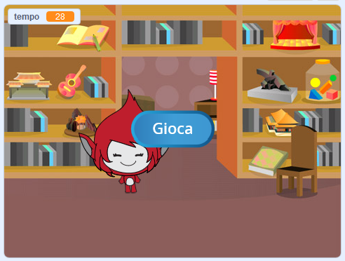
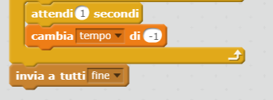

## Giochi multipli

Aggiungiamo un pulsante 'play' al tuo gioco, in modo che tu possa giocare molte volte.

+ Crea un nuovo sprite come pulsante 'Gioca', che il tuo giocatore userà per iniziare una nuova partita. Puoi disegnarlo da solo o modificare uno sprite dalla libreria di Scratch.
    
    

+ Aggiungi questo codice al tuo nuovo pulsante.
    
    ```blocks
        quando si clicca su ⚑
          mostra
          
        quando si clicca su questo sprite
          nascondi
          invia a tutti [inizio v]
             
    ```
    
    Questo codice mostra il pulsante di riproduzione all'avvio del progetto. Quando si fa clic sul pulsante, questo viene nascosto e quindi trasmette un messaggio che avvierà il gioco.

+ Dovrai modificare il codice del tuo personaggio, in modo che il gioco inizi quando ricevono il messaggio `inizio` {:class="blockevents"}, e non quando viene cliccato il flag.
    
    Sostituisci il codice `quando si clicca su ⚑` {:class="blockevents"} con `quando ricevo inizio` {:class="blockevents"}.
    
    

+ Fai clic sulla bandiera verde (vai) e quindi fare clic sul nuovo pulsante di gioco per fare la proca. Dovresti vedere che il gioco non si avvia finché non si fa clic sul pulsante "Gioca".

+ Hai notato che il timer inizia quando viene cliccata la bandiera verde, e non quando inizia il gioco?
    
    
    
    Puoi risolvere questo problema?

+ Click on the stage, and replace the `stop all`{:class="blockcontrol"} block with an `end`{:class="blockevents"} message.
    
    

+ You can now add code to your button, to show it again at the end of each game.
    
    ```blocks
        when I receive [end v]
        show
    ```

+ You'll also need to stop your character asking questions at the end of each game:
    
    ```blocks
        when I receive [end v]
        stop [other scripts in sprite v]
    ```

+ Test your play button by playing a couple of games. You should notice that the play button shows after each game. To make testing easier, you can shorten each game, so that it only lasts a few seconds.
    
    ```blocks
        set [time v] to [10]
    ```

+ You can even change how the button looks when the mouse hovers over it.
    
    ```blocks
        when flag clicked
        show
        forever
        if <touching [mouse-pointer v]?> then
            set [fisheye v] effect to (30)
        else
            set [fisheye v] effect to (0)
        end
        end
    ```
    
    