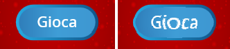

## Giochi multipli

Ora aggiungerai un pulsante "Gioca", in modo che il giocatore possa giocare molte volte.

\--- task \--- Crea un nuovo sprite pulsante 'Gioca' che il giocatore deve cliccare per iniziare una nuova partita.

Puoi disegnare lo sprite da solo o modificare uno sprite dalla libreria.


\--- /task \---

\--- task \--- Aggiungi questo codice al tuo sprite pulsante:


```blocks3
    when flag clicked
    show

    when this sprite clicked
    hide
    broadcast (start v)
```

\--- /task \---

Il nuovo codice include un altro blocco `broadcast`{: class = "block3events"}, che invia il messaggio 'start'.

Il nuovo codice fa apparire lo sprite del pulsante "Gioca" quando il giocatore fa clic sulla bandiera. Quando il giocatore fa clic sul pulsante sprite, lo sprite sparisce e trasmette un messaggio a cui altri sprite possono reagire.

Al momento, lo sprite del personaggio inizia a fare domande quando il giocatore fa clic sulla bandiera. Cambia il codice del gioco in modo che lo sprite del personaggio inizi a porre domande quando riceve la trasmissione "start" `broadcast`{: class = "block3events"}.

\--- task \--- Seleziona il tuo sprite del personaggio e, nella sua sezione di codice, sostituisci il blocco `when flag clicked`{: class = "block3events"} blocca con un blocco quando ricevo start`when I receive start`{: class = "block3events"}.


```blocks3
<br />- when flag clicked
+ when I receive [start v]
set [numero 1 v] to (pick random (2) to (12))
set [numero 2 v] to (pick random (2) to (12))
ask (join (numero 1)(join [ x ] (numero 2))) and wait
if &lt;(answer) = ((numero 1)*(numero 2))&gt; then
    say [si! :)] for (2) seconds
else
    say [no :(] for (2) seconds
end
```

\--- /task \---

\--- task \---

Fai clic sulla bandiera verde, quindi fai clic sul nuovo pulsante "Gioca" per verificare se funziona. Dovresti vedere che il gioco non parte prima di aver fatto clic sul pulsante.

\--- /task \---

Riesci a vedere che il timer inizia quando viene cliccata la bandiera verde, invece di quando inizia il gioco?


\--- task \---

È possibile modificare il codice per il timer in modo che il timer inizi quando il lettore fa clic sul pulsante?

\--- /task \---

\--- task \--- Aggiungi codice al tuo sprite pulsante in modo che il pulsante si mostri di nuovo alla fine di ogni partita.


```blocks3
    when I receive [end v]
    show
```

\--- /task \---

\--- task \---

Prova il pulsante "Gioca" giocando un paio di giochi. Il pulsante dovrebbe apparire alla fine di ogni partita.

Per testare il gioco più velocemente, puoi cambiare il valore di `volte`{: class = "block3variables"} in modo che ogni gioco abbia solo pochi secondi.


```blocks3
    set [tempo v] to [10]
```

\--- /task \---

\--- task \--- È possibile modificare l'aspetto del pulsante quando il puntatore del mouse passa sopra di esso.


```blocks3
    when flag clicked
    show
    forever
    if <touching (mouse-pointer v)?> then
        set [fisheye v] effect to (30)
    else
        set [fisheye v] effect to (0)
    end
    end
```

 \--- /task \---