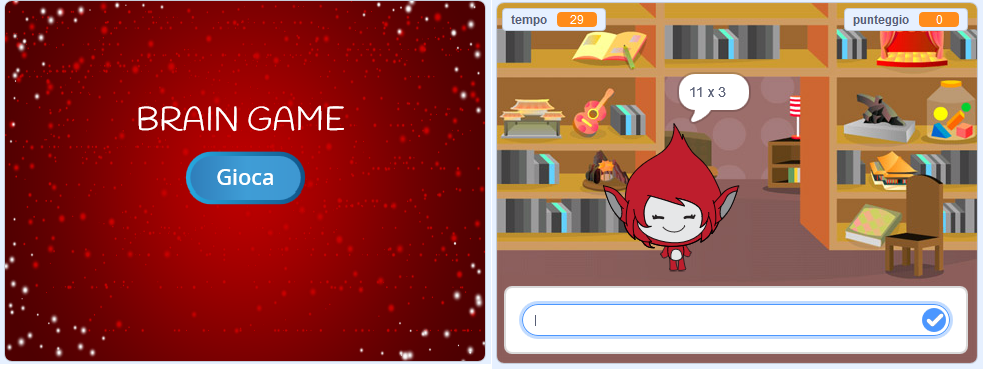

\--- challenge \---

## Sfida: Schermata iniziale

Puoi aggiungere un altro sfondo al tuo stage, che diventerà la schermata iniziale del tuo gioco? Puoi usare i blocchi `quando ricevo inizio` {:class="blockevents"} e `quando ricevo fine` {:class="blockevents"} per passare da uno sfondo all'altro.

Puoi anche mostrare e nascondere il tuo personaggio e persino mostrare e nascondere il tuo timer usando questi blocchi:

```blocks
mostra la variabile [tempo v]
```

```blocks
nascondi la variabile [tempo v]
```



\--- /challenge \---