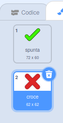
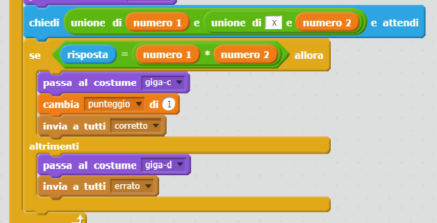
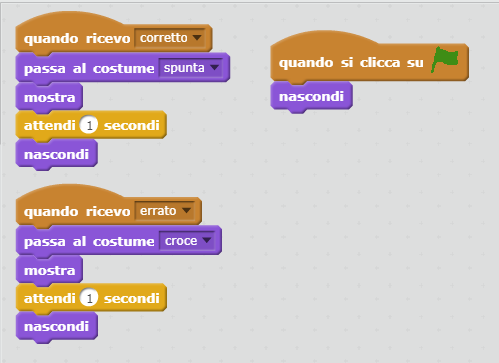
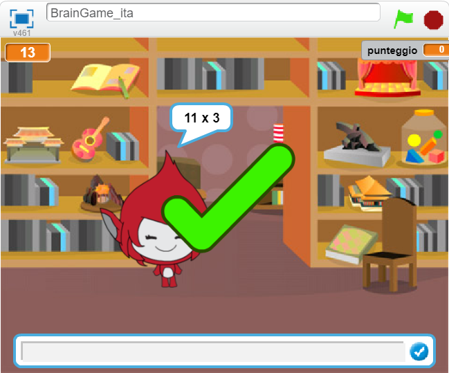
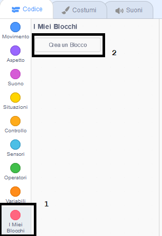
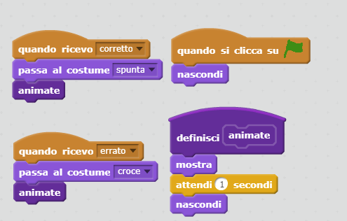

## Aggiungi la grafica

Il tuo personaggio ora sta solo dicendo al giocatore solo `si! :)` o `no :(`, puoi aggiungere alcuni elementi grafici che permetteranno al giocatore di avere informazioni aggiuntive sull'andamento.

+ Crea un nuovo sprite chiamato "Risultato", contenente sia un costume "spunta" che un costume "croce".
    
    

+ Cambia il codice del tuo personaggio, in modo che invece di dire al giocatore come hanno fatto, trasmette invece i messaggi `corretto` {:class="blockevents"} e `errato` {:class="blockevents"}.
    
    

+ Ora puoi usare questi messaggi per mostrare il costume "spunta" o "croce". Aggiungi questo codice al tuo nuovo sprite 'Risultato':
    
    

+ Metti alla prova il tuo gioco. Dovresti vedere un segno di spunta ogni volta che ottieni una domanda corretta e una croce ogni volta che sbagli!
    
    

+ Hai notato che il codice è quasi identico per `quando ricevo corretto` {:class="blockevents"} e `quando ricevo errato` {:class="blockevents"} ? Creiamo una funzione per rendere più semplice la modifica del tuo codice.
    
    Sul tuo sprite 'Risultato', fai clic su `Altri Blocchi` {:class="blockmoreblocks"}, quindi "Crea un Blocco". Crea una nuova funzione chiamata `animate` {: Class = "blockmoreblocks"}.
    
    

+ È quindi possibile aggiungere il codice di animazione alla nuova funzione di animazione, quindi utilizzare la funzione due volte:
    
    

+ Ora, se vuoi mostrare il segno di spunta e la croce per un tempo più o meno lungo, devi solo apportare una modifica al tuo codice. Provaci!

+ Invece di mostrare e nascondere il segno di spunta e la croce, è possibile modificare la funzione di animazione, in modo che la grafica si dissolva.
    
    ```blocks
        definisci [animate]
        porta effetto [ghost v] a (100)
        mostra
        ripeti 25 volte
            cambia effetto [ghost v] di (-4)
        fine
        nascondi[animate]
    ```