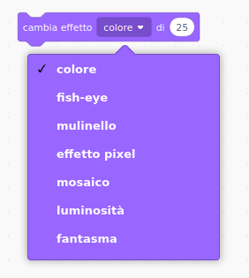

## Aggiungi grafica

Al momento, lo sprite del personaggio dice solo `sì! :)` o `no :(` alle risposte del giocatore Aggiungi alcuni elementi grafici per far sapere al giocatore se la loro risposta è corretta o errata.

\--- task \---

Crea un nuovo sprite chiamato "Risultato" e dagli un costume "tick / check" e un "cross".


\--- /task \---

\--- task \---

Cambia il codice dello sprite del tuo personaggio in modo che, invece di dire qualcosa al giocatore, `trasmetta`{: class = "block3events"} i messaggi "corretto" o "sbagliato".


```blocks3
if <(answer) = ((number 1)*(number 2))> then

- say [si! :)] for (2) seconds
+ broadcast (corretto v)
else
- say [no :(] for (2) seconds
+ broadcast (sbagliato v)
end
```

\--- /task \---

\--- task \---

Ora è possibile utilizzare questi messaggi per mostrare `show`{: class = "block3looks"} il costume 'tic' o 'croce'. Aggiungi il seguente codice allo sprite 'Risultato':


```blocks3
    when I receive [corretto v]
    switch costume to (tick v)
    show
    wait (1) seconds
    hide

    when I receive [sbagliato v]
    switch costume to (cross v)
    show
    wait (1) seconds
    hide

    when flag clicked
    hide
```

\--- /task \---

\--- task \--- Metti alla prova il tuo gioco. Dovresti vedere il segno di spunta ogni volta che rispondi correttamente a una domanda e la croce ogni volta che rispondi in modo errato!


\--- /task \---

Puoi vedere che il codice per `quando ricevo corretto`{: class = "block3events"} e `quando ricevo sbagliato`{: class = "block3events"} è quasi identico?

Così puoi cambiare il tuo codice più facilmente, creerai un blocco personalizzato.

\--- task \---

Seleziona lo sprite 'Risultato'. Quindi fai clic su `I Miei Blocchi`{: class = "block3myblocks"}, quindi su **Crea un blocco**. Crea un nuovo blocco e chiamalo `animate`{: class = "block3myblocks"}.


\--- /task \---

\--- task \--- Sposta il codice per mostrare `show`{: class = "block3looks"} o nascondere `hide`{: class = "block3looks"} lo sprite 'Result' nel blocco `animate`{: class = " blocco3myblocks "}:


```blocks3
define animate
show
wait (1) seconds
hide
```

\--- /task \---

\--- task \--- Assicurati di aver rimosso i blocchi `show`{: class = "block3looks"} e `hide`{: class = "block3looks"} al di sotto di **entrambi** i blocchi `switch costume`{: class = "block3looks"}.

Quindi aggiungere il blocco `animate`{: classe = "block3myblocks"} sotto entrambi i blocchi `dell'interruttore costume`{: class = "block3looks"}. Il tuo codice dovrebbe ora apparire come questo:


```blocks3
    when I receive [corretto v]
    switch costume to (tick v)
    animate:: custom

    when I receive [sbagliato v]
    switch costume to (cross v)
    animate:: custom
```

\--- /task \---

Gazie al blocco personalizzato `animate`{: class = "block3myblocks"}, ora è sufficiente apportare una modifica al codice se si desidera mostrare i costumi dello sprite "Risultato" più o meno a lungo.

\--- task \---

Cambia il tuo codice in modo che i costumi "tick" o "cross" vengano visualizzati per 2 secondi.

\--- /task \---

\--- task \--- Invece di `mostrare`{: class = "block3looks"} e `nascondere`{: class = "block3looks"} i costumi "tick" o "cross", puoi cambiare `animate` {: class = "block3myblocks"} in modo che i costumi sbiadiscano.


```blocks3
    define animate
    set [ghost v] effect to (100)
    show
    repeat (25)
        change [ghost v] effect by (-4)
    end
    hide
```

\--- /task \---

Puoi migliorare l'animazione della grafica 'tick' o 'cross'? Puoi aggiungere del codice per far sparire anche i costumi, oppure puoi usare altri effetti interessanti:

