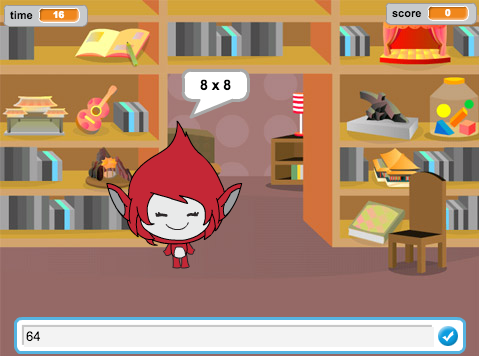

## はじめに

このプロジェクトでは、30秒でできるだけたくさんのかけ算を解くクイズの作り方を学びます。

  <iframe allowtransparency="true" width="485" height="402" src="https://scratch.mit.edu/projects/embed/42225768/?autostart=false" frameborder="0"></iframe>
  

### クラブリーダーのための追加情報

このプロジェクトを印刷する必要がある場合は、 [印刷用バージョン](https://projects.raspberrypi.org/en/projects/brain-game/print)を使用してください。

## \--- collapse \---

## title：クラブリーダー・ノート

## はじめに

このプロジェクトでは、30秒でできるだけたくさんのかけ算を解くクイズの作り方を学びます。

## 資料

このプロジェクトでは、スクラッチ2を使用して下さい。 スクラッチ2は、オンラインで使用できます。 [jumpto.cc/scratch-on](http://jumpto.cc/scratch-on) また、こちら[jumpto.cc/scratchoff](http://jumpto.cc/scratch-off) からダウンロードしてオフラインで使用する事も可能です。

このプロジェクトの完成版は [こちら](http://scratch.mit.edu/projects/42225768/#editor)から確認できます。また、「プロジェクト資料のダウンロード」をクリックしてダウンロードすることもできます。中身は下記の通りです。

* BrainGame.sb2

## 学習のねらい

* このプロジェクトは以前学んだプログラミングの方法をまとめ、シンプルなゲームのメニューを作るために「メッセージ」を送る方法を学びます。

このプロジェクトは [Raspberry Pi Digital Making Curriculum](http://rpf.io/curriculum)の中から、以下の内容を取り扱います：

* [プログラミング構造を組み合わせて問題を解決する。](https://www.raspberrypi.org/curriculum/programming/builder)

## チャレンジ

* 「コスチュームを変える」：答えが正しいかどうかによって、キャラクターの見た目を変更します。
* 「得点をつける」：正しく答えるごとに１点ずつ増やします。
* 「スタート画面」：2つのゲーム画面を作り、 `スタート` {:class="blockevents"}と `終わり` {:class="blockevents"} のメッセージを送ることで背景を切りかえます。
* 「アニメーション」：ループや特殊効果を使って、「正しい」か「間違い」か表示するアニメーションを加えます。
* 「効果音と音楽」：音楽ループと効果音の学習のまとめを行います。
* 「10点を目指す」：ゲームのロジックを変えて、新しい目的のゲームに変更します。
* 「使い方の画面」：ゲームメニューを作成するメッセージの使用方法のまとめとして、「インストラクション」ボタンを作ります。

\--- /collapse \---

## \--- collapse \---

## title: プロジェクト資料

## 指導者用資料

* [完成版Scratch2プロジェクト（ダウンロード）](resources/BrainGame.sb2)
* [完成版Scratch2プロジェクト（オンライン）](http://scratch.mit.edu/projects/42225768/#editor)

\--- /collapse \---