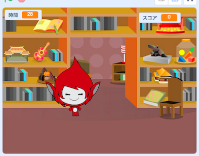

--- no-print ---

これは、**Scratch 3**バージョンのプロジェクトです。[ Scratch 2バージョンのプロジェクト](https://projects.raspberrypi.org/ja-JP/projects/brain-game-scratch2)もあります。

--- /no-print ---

## はじめに

このプロジェクトでは、プレイヤーが30秒以内にできるだけ多くの正解を答えるという算数クイズを作成します。

### 作るもの

--- no-print ---

ボタンを押して始めます。質問への回答を入力し、<kbd>Enter</kbd>キーを押します。

  <iframe allowtransparency="true" width="485" height="402" src="https://scratch.mit.edu/projects/embed/250234955/?autostart=false" frameborder="0" scrolling="no"></iframe>
  

--- /no-print ---

--- print-only ---

--- /print-only ---

--- collapse ---
---
title: 学習すること
---
+ Scratchでブロードキャストを使用する方法
+ カスタムScratchブロックを作成して使用する方法

--- /collapse ---

--- collapse ---
---
title: 必要なもの
---

### ハードウェア

+ Scratch 3を実行できるコンピュータ

### ソフトウェア

+ Scratch 3 ([オンライン](https://rpf.io/scratchon){:target="_blank"}または[オフライン](https://rpf.io/scratchoff){:target="_blank"})

--- /collapse ---

--- collapse ---
---
title: 教育者向けの追加メモ
---

--- no-print ---

このプロジェクトを印刷する必要がある場合は、 [印刷用バージョン](https://projects.raspberrypi.org/ja-JP/projects/brain-game/print)を使用してください。

--- /no-print ---

[完成したプロジェクトはこちら](https://rpf.io/p/ja-JP/brain-game-get){:target="_blank"}にあります。

--- /collapse ---