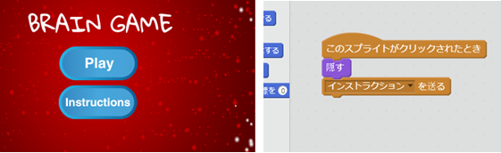

\--- challenge \---

## チャレンジ：使い方の画面

ゲームに使い方の画面を加えて、プレーヤーにゲームの遊び方を教えることはできますか？「インストラクション」ボタンともう一つの背景が必要になります。



メニューに戻れるように、「戻る」ボタンも加えたほうが良いでしょう。

```blocks
    [main menu v] を送る
```

\--- /challenge \---