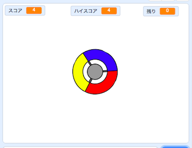

## 次は何をしますか？

[ドットをキャッチする](https://projects.raspberrypi.org/ja-JP/projects/catch-the-dots?utm_source=pathway&utm_medium=whatnext&utm_campaign=projects) プロジェクトをして、リアクションゲームを作りましょう！ このプロジェクトでは、スプライトのクローンを作る方法と、変数を使ってゲームを徐々にスピードアップする方法を学びます。

--- no-print ---

キーボードの矢印キーを使用してコントローラホイールを回転させ、中心に飛んでくるドットをキャッチします。3回間違えると、ゲームはおしまいです。

  <iframe allowtransparency="true" width="485" height="402" src="https://scratch.mit.edu/projects/embed/252923761/?autostart=false" frameborder="0" scrolling="no"></iframe>
  

--- /no-print ---

--- print-only ---

--- /print-only ---

***

このプロジェクトは以下のボランティアによって翻訳されました。

UMEHARA Reiko

ボランティアのおかげで、世界中の人々に母国語で学ぶ機会を与えることができます。翻訳を引き受けていただくことで、より多くの人々に手を差し伸べることができます。詳しくは [rpf.io/translate](https://rpf.io/translate) をご覧ください。